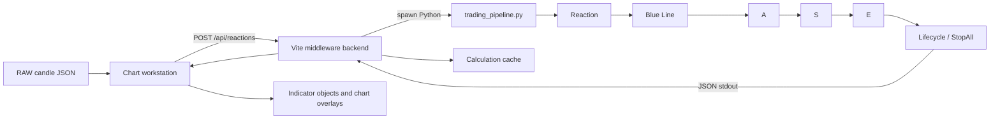
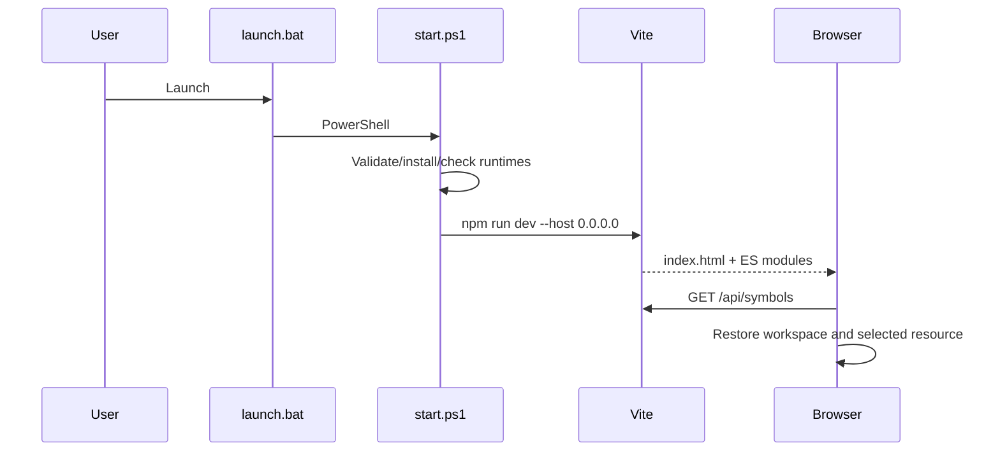

# TradingBot Technical Architecture

Evidence date: 2026-09-18  
Repository root: `D:/My-Projects/TradingBot`  
Audited state: current working tree, including pre-existing tracked and untracked changes

## 1. Authority and Scope

This document describes the implementation present in the working tree. It does not describe only commit `0d084590fb1ba1b57bcac6d4f19c977557830c2d`, because the active runtime currently references untracked replacement engine modules while tracked legacy modules are deleted. Source code is authoritative; generated assets, cached calculation payloads, and historical algorithm documents are evidence only.

The runtime calculation authority is Python. Browser JavaScript acquires data, requests calculations, manages interaction state, and renders serialized results; it does not own the trading rules.

## 2. System Overview

TradingBot is a Windows-oriented local chart workstation with four major subsystems:

| Subsystem | Primary paths | Responsibility |
|---|---|---|
| Launcher | `scripts/launch.bat`, `scripts/start.ps1` | Runtime checks, directory creation, dependency bootstrap, and Vite startup |
| Chart workstation | `apps/chart/index.html`, `apps/chart/src/main.js`, feature/UI/chart modules | Candle visualization, range selection, drawing tools, indicator controls, persistence, and rendering |
| Local backend | `apps/chart/vite.config.js`, `apps/chart/server/*.js` | HTTP APIs, RAW resource storage, FARAZ acquisition, calculation subprocesses, caches, drawings, templates, and SSE progress |
| Trading engine | `engine/bridge/trading_pipeline.py`, `engine/pipeline/*.py` | Candle normalization, Reaction, Blue Line, A, S, E, lifecycle/StopAll, reconciliation, and JSON serialization |



## 3. Technology Stack

| Area | Actual technology |
|---|---|
| Browser | Native ES modules, HTML, CSS, Lightweight Charts 5.2.1 |
| Development/backend host | Node.js, Vite 8.2.1 Connect middleware |
| Browser automation/data provider integration | Playwright Core 1.63.0 installed (`^1.62.1` manifest) |
| Trading runtime | Python 3.12+ launcher requirement; current bytecode artifacts use CPython 3.14 |
| Python data/serialization | Standard library, `Decimal`, `zoneinfo`, `orjson` |
| Tests | Node built-in test runner (`node --test`) |
| Storage | JSON files, sidecar metadata, browser `localStorage`, in-memory state |
| Communication | HTTP JSON, Server-Sent Events, Python stdout/stderr subprocess protocol |
| Build | Vite build target `chrome89` |

The chart package reports application version `3.4.1`. Repository release numbering is separate from the package version; the integrated release is published as Git tag `v2.1.0` without renumbering the chart package.

No Python package manifest, CI workflow, linter configuration, or type-check configuration was found.

## 4. Repository Structure

### `apps/chart`

The complete browser application and local backend.

- `index.html`: main workstation shell.
- `review.html`: manual indicator-review page.
- `src/main.js`: primary application controller and state owner; it coordinates inventory, loading, chart projection, drawing, indicator execution, persistence, panels, and event wiring.
- `src/chart/`: LOD, progress, state, coordinate projection, view transforms, and zoom configuration.
- `src/features/`: candle acquisition/update, RAW inventory contracts, indicator cache/lifecycle, workspace sessions, screenshots, and manual review.
- `src/ui/`: feedback, logging, popovers, icons, symbol formatting, and workspace-state helpers.
- `src/algorithm/`: in-application algorithm reference page and its content model.
- `server/`: RAW storage/integrity/migration and FARAZ integration.
- `tests/`: 21 Node test files covering 111 declared test cases at audit time.
- `dist/`: generated build output; it predates some current source changes and is not treated as authoritative.
- `node_modules/`: installed vendor dependencies; inventoried separately from project-owned source.

### `engine`

The deterministic calculation authority.

- `bridge/trading_pipeline.py`: CLI boundary, dynamic module loading, source parsing, market-context preparation, stage orchestration, visibility, telemetry, and serialization.
- `pipeline/reaction_engine.py`: candle models, lower-timeframe chronology, Bullish/Bearish Reaction and Reset detection.
- `pipeline/blue_line_detector.py`: Blue Line construction and stop/strike semantics.
- `pipeline/a_zone_detector.py`: A-zone ownership and special/double-stop paths.
- `pipeline/s_zone_detector.py`: S candidates, order geometry, decision races, and S outputs.
- `pipeline/e_zone_detector.py`: E source/order selection, continuation, audit, and reconciliation inputs.
- `pipeline/lifecycle_engine.py`: final visibility, ownership, StopAll construction, and single-pass historical reconciliation.
- `pipeline/core_utils.py`: shared identity, Decimal, ordering, and comparison helpers.
- `pipeline/direction_policy.py`: directional field/comparison policy.
- `styles/reaction-detector.css`: presentation styles only; it is not calculation authority.

### `data/raw`

Broker/symbol-partitioned RAW candle arrays with `.meta.json` sidecars. At the current-turn checkpoint, `data/raw` contains one active `FOREXCOM/XAUUSD` 5-second JSON file with 70,125 candles plus its sidecar. The four-dataset/303,065-candle totals in older audit sections are historical checkpoint evidence, not current inventory. The active file passed the repository's bounded schema, numeric, OHLC, chronology, duplicate, sidecar SHA-256, byte-count, and candle-count checks; market gaps are reported separately and are not automatically classified as defects.

### `runtime/cache`

- `drawings/`: per-resource drawing JSON.
- `indicator-calculations/`: historical serialized calculation payloads and `.info.json` metadata.
- `indicator-templates/`: indicator template persistence.
- `secret/`: FARAZ session envelope. Its values are deliberately not reproduced in documentation.

### `scripts`

Windows launcher/bootstrap scripts. These scripts are operational entry points, not read-only validation tools: `start.ps1` may install dependencies and create directories.

## 5. Entry Points and Startup Lifecycle

### `scripts/launch.bat`

Validates the presence of the PowerShell launcher, chart manifest/dev server, and `engine/bridge/trading_pipeline.py`, then starts PowerShell with `ExecutionPolicy Bypass`.

### `scripts/start.ps1`

Important functions include project-file validation, directory creation, Node/Python/npm checks, Python package checks, syntax compilation, npm dependency checks, and Vite startup. It requires Node.js 20.19+, Python 3.12+, npm, `orjson`, and `tzdata`. It sets `TRADINGBOT_PYTHON` and starts:

```text
npm run dev -- --host 0.0.0.0 --configLoader native
```

### Browser startup

`apps/chart/index.html` loads `src/main.js`. The final startup chain in `main.js` calls `loadInventory()` and then `restoreWorkspaceAfterRefresh()`.



## 6. Browser Application Architecture

`apps/chart/src/main.js` owns the main mutable `state`, including:

- RAW and aggregated candles;
- broker/symbol/file inventory;
- selected timeframe and requested range;
- Lightweight Charts objects and viewport density;
- drawing objects, history, selection, tools, lock/visibility state;
- workspace preferences and panel dimensions;
- indicator form state, calculation result, render objects, visibility, timing, and activity;
- runtime errors and health information.

### Data load flow

1. `loadInventory()` / `refreshSymbolInventory()` requests `/api/symbols`.
2. `loadFile(item)` requests `/api/candles?id=...`.
3. The response becomes `state.raw`.
4. `aggregate()` constructs the display timeframe.
5. `renderChartViewport()` renders the full display series or a level-of-detail projection.
6. Drawings and prior indicator context are restored.
7. Workspace and selected-resource state are persisted.

For more than 100,000 display candles, rendering uses `buildCandleLod()`, `chooseLodStride()`, and density hysteresis. The original RAW array remains calculation/export authority.

### Indicator flow

`calculateIndicator()` validates the range/direction, starts an SSE progress connection, POSTs `/api/reactions`, stores the result/metadata, calls `rebuildIndicatorObjects()`, and finishes with `drawAll()`.

### Data update flow

`runChartUpdate()` calculates missing/latest ranges, requests FARAZ history concurrently, validates and merges received candles, writes bounded batches through `/api/candle-files/update`, and records verification coverage.

## 7. Local HTTP Backend

`apps/chart/vite.config.js` implements the backend through Vite middleware.

| Group | Routes |
|---|---|
| Inventory/data | `/api/symbols`, `/api/candles`, `/api/info/...`, `/info/...` |
| Calculation | `/api/reactions`, `/api/reactions/progress`, `/api/reactions/cache` |
| Persistence | `/api/drawings`, `/api/indicator-templates`, `/api/candle-files/delete`, `/api/candle-files/migrate`, `/api/candle-files/update`, `/api/candle-files/verification`, `/api/chart-transfer/export`, `/api/chart-transfer/import` |
| FARAZ | `/api/faraz/auth/*`, `/api/faraz/candles/*`, `/api/faraz/history` |

No application WebSocket was found. Calculation progress uses Server-Sent Events. Playwright may use an internal browser-server WebSocket.

## 8. Python Bridge Contract

`engine/bridge/trading_pipeline.py:parse_arguments()` accepts engine-module paths, enable/disable switches, `--data`, `--timeframe`, `--from-time`, `--to-time`, and `--direction bullish|bearish|both`.

The bridge:

1. Loads the maintained engine modules dynamically.
2. Reads and parses the full physical RAW JSON file through `orjson`.
3. Normalizes candle prices to `Decimal`.
4. Builds lower-timeframe and selected-timeframe candle structures.
5. Calculates complete context before applying presentation-range visibility.
6. Emits machine-readable progress as `QG_PROGRESS:<json>` on stderr.
7. Emits one JSON result on stdout.
8. On top-level failure, emits a compact `{"error": ...}` object and exits non-zero.

`prepare_market_context()` deliberately uses the complete RAW file. `from-time` and `to-time` define the final presentation window, not the calculation context.

### Bridge function contracts

| Function | Inputs and retained state | Output | Primary consumers / side effects |
|---|---|---|---|
| `prepare_market_context(args, engines, timings)` | Full RAW rows, requested timeframe/window, Reaction candle types and shared lower index | `MarketContext` with lower/main candles, chronology, full-file identities, visible indexes | `prepare_pipeline_state` and direction range calculation; records timings but applies no trading visibility rule |
| `prepare_pipeline_state(args, engines, market, timings)` | Engine bundle and immutable market context; computes both directions when opposite context is required | `PipelineState` with Reaction results, geometry detectors, full Blue/A/S/E context, invalid identities and audit state | All requested direction builders; calculation authority before range visibility |
| `calculate_full_direction_state(direction, ...)` | One direction plus opposite Reaction/Reset context, chronology and geometry callbacks | `FullDirectionState` with reconciled Blue/A/S/E, candidates, invalid identities and accepted audit context | Stored in `PipelineState`; can rebuild E two to four times |
| `calculate_direction_range_state(direction, ...)` | Full state, visible main-index window and enable flags | `DirectionRangeState` | `finalize_direction_visibility`; selects range-owned sources without replacing full identities |
| `finalize_direction_visibility(direction, ...)` | Range state, lifecycle engine, full E detector and chronology | `DirectionVisibilityState` | Applies A/S lineage closure, one StopAll pass, internal/range filtering and audit preparation |
| `serialize_direction_payload(...)` | Accepted visibility and full Reaction result | Public direction object | Converts values/identities only; must not introduce trading behavior |
| `build_response_payload(...)` | Requested directions, versions, flags and timings | Public JSON envelope | Written once to stdout by the CLI |

## 9. Pipeline Architecture

Current source version constants:

| Layer | Version |
|---|---:|
| Trading pipeline | `1.2.2` |
| Reaction | `9.5.2` |
| Blue Line | `2.3.0` |
| A | `1.6.3` |
| S | `4.13.1` |
| E | `6.6.2` |
| StopAll/lifecycle | `1.10.1` |

High-level orchestration:

```text
prepare_market_context
  -> prepare_pipeline_state
       -> Reaction/Reset detection
       -> Blue Line detection
       -> A detection
       -> S detection
       -> E detection
       -> order/validity/shared-stop reconciliation
       -> lifecycle/StopAll reconciliation
  -> calculate_direction_range_state
  -> finalize_direction_visibility
  -> serialize_direction_payload
  -> build_response_payload
```

When S/E behavior is enabled, `prepare_pipeline_state()` computes both directions because later stages consume opposite-direction reactions/resets and shared ownership. `calculate_full_direction_state()` may run E multiple times after S validity, final order-audit, shared accepted-order-stop, and consumed-continuation reconciliation. `reconcile_stopall_lifecycle()` performs one StopAll detection/reconciliation pass; it is not a fixed-point StopAll loop. The algorithm references contain stage-specific details.

### Important class contracts

| Class | Constructor dependencies | Important retained state | Output / consumers |
|---|---|---|---|
| `MarketChronology` | Main candles, lower candles, timeframe, optional shared `LowerTimeframeIndex` | main/lower timestamps, `[start,end)` windows, confirmation/reset caches, main-index mapping, canonical Order stops | Shared immutable time service used by Blue/A/S/E/StopAll and serializers |
| `BullishDetector` / `BearishDetector` | Main/lower candles and inclusive analysis indexes | Directional candidate state and lower index | Initial Reaction/Reset evidence for `UnifiedReactionDetector` |
| `UnifiedReactionDetector` | Main/lower candles, inclusive indexes, output direction | lazy directional helpers, both-direction Reaction/Reset ledgers, geometry caches | `DetectionResult` and direct/order geometry callbacks consumed by S/E |
| `AZoneDetector` | Direction, trend Reactions, Blue Lines, chronology | direction policy, sorted Blue provenance, lower/main views | Frozen A zones consumed by S and lifecycle visibility |
| `SZoneDetector` | Trend/opposite Reactions, trend Blues, A zones, chronology, range, opposite Resets, Order callback | A ownership windows, physical Order audit, Reset/Blue indexes and candidate caches | S candidates/zones, stopped-A audit and Order ledger consumed by E/lifecycle |
| `EZoneDetector` | Trend/opposite Reactions and Resets, S zones, chronology, geometry callbacks, sequence priority/reset map | accepted/blocked Orders, E chains, cause/audit ledgers and lifecycle bounds | Reconciled E, accepted OrderAudit and continuation inputs consumed by lifecycle/serialization |
| `StopAllDetector` | Direction, accepted S/E and chronology | sorted E, shared lower index, dominant sequence/group state | Numbered StopAll; lifecycle removes same-source public E and freezes sequence resets |

Detector constructors reject unsupported directions. S and E validate analysis ranges/dependencies. Exact directional rules and serialized fields remain in the Bullish and Bearish references.

## 10. Data Contracts

### RAW candles

Exact row schema:

```json
{"time": 1788449740, "open": 0, "high": 0, "low": 0, "close": 0}
```

Requirements enforced by current storage/bridge paths include numeric OHLC, valid high/low bounds, ordered Unix timestamps, and deterministic aggregation.

### Calculation envelope

The response contains engine/pipeline/module versions, actual calculated range, timeframe, enable switches, timings, and a `directions` object. Each direction can expose reactions, resets, Blue Lines, A/S/E zones, StopAll objects, and order-audit records. Exact field contracts are documented in the Bullish and Bearish references.

## 11. State and Persistence

| State | Owner | Persistence |
|---|---|---|
| Active chart/application | `src/main.js` | In memory plus selected `localStorage` fields |
| Workspace/panels/settings | browser helpers | `localStorage` |
| Drawings | browser + `/api/drawings` | JSON files under `runtime/cache/drawings` |
| Chart transfer | browser File System Access picker + `/api/chart-transfer/*` | Export folder preserves the source RAW filename, sidecar filename, and chart drawing filename; import validates the manifest before writing canonical RAW/drawing paths |
| Indicator templates | browser + `/api/indicator-templates` | `runtime/cache/indicator-templates/templates.json` |
| Calculation results | Vite middleware | `runtime/cache/indicator-calculations` |
| FARAZ session | FARAZ server module | `runtime/cache/secret/faraz-session.dpapi.json` |
| RAW candles | raw resource store | `data/raw/...json` plus schema-v2 sidecar |

No active IndexedDB writer was found. `indicator-cache.js` can enumerate/delete IndexedDB databases during cache clearing.

## 12. Configuration

Recognized environment variables:

- `TRADINGBOT_PYTHON`
- `TRADINGBOT_PROJECT_ROOT` (set by the launcher but not consumed by current JS/Python source)
- `TRADINGBOT_VITE_POLLING`
- `TRADINGBOT_VITE_POLL_INTERVAL_MS`
- `FARAZ_BROWSER_PATH`

Vite defaults to port 5173 and `strictPort: false`. The launcher binds to all interfaces.

## 13. Logging, Progress, and Errors

- Browser logging uses structured events and captures `window.error` plus `unhandledrejection` into runtime health state.
- Python progress events are emitted to stderr with a `QG_PROGRESS:` prefix and separated from ordinary error text by the Node subprocess wrapper.
- FARAZ jobs retain bounded public logs, normalize errors, retry selected failures, expose cancellation, and surface incomplete-coverage decisions.
- `trading_pipeline.py:timed()` emits a completed stage event in `finally`; a failed stage can therefore have a completion-timing event followed by the overall failure.

## 14. External Integrations

The maintained external integration is FARAZ (`https://faraz.io` and approved related hosts). `createFarazCandleApi()` uses Playwright Core with a locally installed Chromium-family browser, captures session/storage state, sends history requests, applies concurrency/rate/retry controls, and writes validated RAW resources through local APIs.

The main chart also loads remote Google-hosted fonts. The core chart library is locally installed.

## 15. Performance-Critical Paths

- Full-file JSON parsing and Decimal normalization in `prepare_market_context()`.
- Lower-timeframe indexing and chronology queries in `reaction_engine.py`.
- Cross-direction S/E/lifecycle reconciliation and possible repeated E passes.
- Synchronous calculation-source hashing in `vite.config.js`.
- RAW inventory walking, validation, hashing, and metadata repair in `raw-resource-store.js:list()`.
- LOD projection and coordinate transformation for large chart datasets.
- FARAZ packet concurrency, retry, cooldown, and coverage replay.
- Synchronous filesystem operations inside Vite middleware, which can block its event loop.

## 16. Testing and Validation Interfaces

Supported chart commands:

```text
cd apps/chart
npm test
npm run build
npm run dev
npm run preview
```

There is no repository-local Python test suite, lint command, type-check command, or CI workflow. `scripts/start.ps1` performs `py_compile`, but it is not a read-only validator because it can install software/packages and create directories.

## 17. Trust Boundaries and Known Architecture Risks

The detailed findings are in `TradingBot_Project_Audit.md`. The most important architecture constraints are:

1. The current runtime relies on pre-existing untracked replacement engine files.
2. Vite is LAN-bound and exposes mutating local APIs without an application authentication layer.
3. The FARAZ session envelope is currently clear-text despite a `.dpapi.json` filename.
4. Some read paths can repair/write metadata.
5. Calculation cache identity depends on RAW mtime rather than the RAW content hash.
6. Large central modules create broad coupling.
7. Generated build/cache/bytecode artifacts can drift from current source.

## 18. Graphify

The fresh directed Graphify is stored under `docs/graphify/`. Its extraction snapshot covered 620 non-Git files before task-owned intermediates were removed; 522 supported files contributed parsed or semantic content. The final post-cleanup inventory contains 619 files. The graph retains extraction-snapshot nodes for task artifacts deleted after the build, and the Graphify README/health report distinguish that snapshot from the final inventory. Graphify is a navigation aid; source remains authoritative, especially where relationships collapse or generated/vendor files yield weak symbols.
