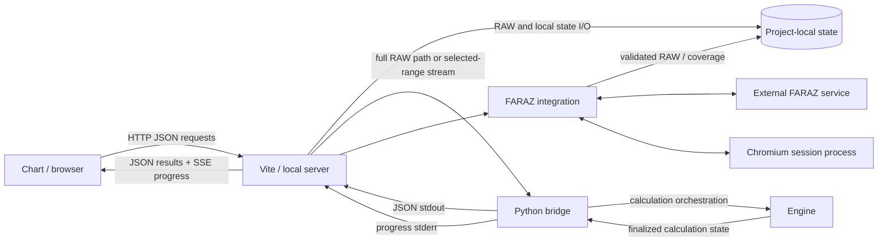

# TradingBot Technical Architecture

## 1. Purpose and boundary

This document is the maintained reference for the **Current TradingBot system architecture**. It describes subsystem ownership, runtime boundaries, data flow, state ownership, persistence/cache boundaries, process integration, and the public result path.

It is subordinate to the root [`AGENTS.md`](../../../AGENTS.md) and [Documentation Governance](../documentation-governance.md). It is not an Algorithm Reference, a UI/UX specification, a testing manual, a release guide, or a historical audit.

Detailed trading semantics belong to the current canonical trading-knowledge system and accepted Algorithm References. Detailed interaction and visual behavior belongs to the [UI/UX Reference](ui-ux-reference.md). Operational storage rules belong to [Local State](../operations/local-state.md).

## 2. Architectural authority and discovery

Architecture is reconstructed from the current live repository, with current Source/configuration defining executable behavior.

Use these durable discovery rules:

- discover production components from current runtime entry points, imports, configuration, and dependency closure;
- treat filenames named below as current examples and discovery anchors, not a permanent exhaustive inventory;
- do not define architecture by commit identity, hashes, mutable versions, module counts, route counts, test counts, or benchmark snapshots;
- use historical/generated material only as supporting evidence;
- if intended architecture and Current Source conflict, report the mismatch rather than rewriting Source or documentation to hide it.

The major architectural domains are **Chart**, **Vite/local server**, **FARAZ**, and **Engine**.

## 3. Architecture principles

1. **Engine owns trading truth.** Trading calculation, trading state, stage execution, lifecycle/reconciliation, and finalized semantic results belong to Engine.
2. **Chart owns presentation and interaction.** The browser may request, render, review, filter, and persist presentation/workspace state, but it must not independently recreate trading truth.
3. **Vite/local server owns orchestration and transport.** It validates local API requests, coordinates files/services/processes, selects the Engine input transport, persists transport/cache artifacts, and returns finalized results.
4. **FARAZ owns acquisition, not semantics.** FARAZ integration authenticates, retrieves, validates, and persists market data; it does not define TradingBot trading rules.
5. **Serialization is a projection boundary.** Serialization exposes finalized Engine state; it must not repair or redefine the calculation.
6. **Cache is subordinate.** Cached results and inventories are performance/persistence support, never semantic authority.
7. **State follows its owner.** Browser/workspace state, server orchestration state, acquisition/session state, and Engine calculation state are separate domains.
8. **Calculation scope and presentation scope are distinct.** The Engine calculates the complete input stream it actually receives; public range filtering is applied inside that supplied-input context.

## 4. System context

TradingBot is a workstation-style application with a browser UI, an in-process Vite/local HTTP server, a Python calculation subprocess, project-local persisted state, and an external FARAZ integration.



The diagram is conceptual. Internal files may be reorganized without changing this architecture if ownership and contracts remain the same.

## 5. End-to-end runtime flows

### 5.1 Chart loading

1. Chart requests the current RAW inventory from the local server.
2. The server resolves project-local RAW resources through the RAW store.
3. Chart requests the selected candle resource.
4. The server streams the RAW JSON and supports normal HTTP cache revalidation.
5. Chart normalizes the rows for visualization and owns the resulting presentation/workspace state.

This path does not perform trading calculation.

### 5.2 Trading calculation

1. Chart builds a calculation request containing the selected chart identity, analysis/chart timeframes, inclusive user-selected range, direction, and request identity.
2. Vite validates resource identity, range boundaries, direction, and options.
3. Vite determines whether the requested range is the complete source or a selected subset.
4. Vite either supplies the original RAW path or prepares a selected in-memory row stream.
5. Vite launches the Python bridge as a child process with the current Engine component paths and calculation arguments.
6. The bridge loads the configured Engine components, reads the entire supplied input, normalizes chronology/candles, runs the required calculation/lifecycle pipeline, finalizes visibility/state, and serializes the requested direction output.
7. Python writes machine-readable progress events to stderr and the final JSON result to stdout.
8. Vite may persist the serialized result under its calculation cache and returns the same finalized result to Chart.
9. Chart renders the result and may open the Manual Review surface using the persisted calculation identity.

### 5.3 Market-data acquisition

1. Chart/FARAZ UI initiates an acquisition or update request through the local server.
2. FARAZ integration uses the current authenticated/session boundary to communicate with allowlisted FARAZ service hosts.
3. Received candle payloads are normalized and validated.
4. The RAW store persists valid project-local RAW data and associated metadata/coverage state.
5. The resulting RAW resource becomes available through the normal Chart inventory/load flow.

Acquisition creates or updates input data. It does not execute Engine trading semantics.

## 6. Chart architecture

### Responsibility

Chart is the browser-side workstation and presentation owner. It owns:

- chart rendering and visual overlays;
- workspace navigation and interaction;
- user selection of symbols, timeframes, directions, and visible/calculation ranges;
- drawing interaction and presentation;
- browser-side preferences and workspace/session presentation state;
- calculation request initiation;
- progress consumption;
- rendering of finalized Engine results;
- Manual Review presentation.

Current composition is rooted in the chart application entry point and supporting `src/` feature, chart, drawing, UI, and review modules. These paths are discovery anchors, not an exhaustive future inventory.

### Inputs and outputs

Chart consumes:

- RAW inventory/candle responses from the local server;
- persisted drawings/templates where exposed by the server;
- calculation progress events;
- finalized serialized calculation payloads;
- FARAZ acquisition/job status.

Chart produces:

- HTTP requests for data, state, acquisition, and calculation;
- user interaction and presentation-state changes;
- drawing persistence requests;
- browser-local preference state.

### Owned state

Chart owns ephemeral UI state and browser-local presentation preferences. Some durable presentation state, such as drawings and indicator templates/calculation artifacts, is persisted through the local server under project-local state ownership.

### Forbidden responsibility

Chart must not infer a different Reaction/A/S/E/Order/lifecycle result from candles or repair a serialized Engine result. The Manual Review implementation is explicitly presentation-only: behavior identity, prices, and Orders come from the bridge payload.

## 7. Vite / local-server architecture

The Vite configuration supplies the local backend boundary through server middleware and composes current service modules.

### Responsibility

The Vite/local-server layer owns:

- local HTTP/API routing and validation;
- browser/server mediation;
- RAW inventory and candle delivery;
- drawing/template and calculation-result persistence;
- calculation-cache coordination;
- chart-transfer and RAW lifecycle orchestration;
- Engine child-process launch;
- full-source versus selected-range input preparation;
- SSE calculation-progress transport;
- response and error transport;
- integration of the FARAZ service module;
- serving the runtime review shell.

### Engine process boundary

Vite launches the Python bridge as a separate process. It provides Engine component locations and request arguments, collects stdout as the final JSON response, and interprets prefixed stderr records as progress events.

After a calculation-cache miss, a FIFO coordinator runs at most one Engine child by default. `TRADINGBOT_MAX_ENGINE_CONCURRENCY` accepts an integer from 1 through 8; invalid values stop server initialization. Concurrent requests with the same public calculation cache identity and RAW content digest share one execution and receive independent progress events. A cache hit requires an internal stamp matching that digest. An unchanged RAW keeps its calculation ID; changed RAW bytes with a preserved timestamp receive a separate ID so an existing stamped report stays intact. The server rechecks RAW and calculation Source before serving a cache hit; a calculation rejects a RAW source changed while it waited or ran, before its result is cached. Shutdown aborts owned calculations and closes their progress channels. Progress history retains at most 120 events per request; a finished channel is released after its last observer disconnects, while unobserved terminal history remains replayable for the life of the server process. These server controls leave Engine Source and both Algorithm References unchanged.

Vite does not reproduce Engine trading stages. Its calculation responsibility ends at validation, input preparation, process orchestration, transport, cache coordination, and persistence of already-serialized results.

### Local file boundary

The server accesses project-local state through the shared local-state resolver. Direct Vite static access to state, test, archive, and verification areas is denied; supported application access occurs through explicit API/service paths.

## 8. FARAZ architecture

FARAZ is an external market-data integration owned by the local server domain.

### Verified responsibilities

FARAZ integration owns:

- user-driven browser/session establishment;
- local session-state handling;
- bounded external history requests;
- host validation for FARAZ service calls;
- candle-response normalization and validation;
- acquisition job status/cancellation;
- coverage/recovery coordination;
- persistence of acquired/updated RAW resources through the RAW store.

The current implementation can coordinate a Chromium-based browser process for session capture and reuse. Session material remains in the project-local secret boundary and must never be exposed in architecture documentation or logs.

### Boundary invariant

FARAZ data can become Engine input only after it is persisted/validated through the local data boundary. FARAZ does not own Reaction, Blue, A, S, E, Order, OrderAudit, StopAll, lifecycle, or any other trading semantic.

## 9. Engine architecture

Engine is the authoritative calculation subsystem under `engine/`. Its production closure must be discovered recursively from the current bridge/runtime loading and imports.

### System responsibility

Engine owns:

- authoritative trading calculations;
- normalized market chronology used by calculations;
- directional calculation state;
- stage-specific state and accepted objects;
- physical Order/OrderAudit calculation ownership;
- cross-stage lifecycle, visibility, priority, and StopAll reconciliation;
- finalized semantic results before transport/presentation.

### Current stage ownership model

Current Source contains separate owners for concepts such as Reaction/Reset, Blue, A, S, E, Order/OrderAudit, and lifecycle/StopAll. Shared helpers provide behavior-neutral Decimal, identity, direction, and chronology primitives where appropriate.

These names describe the current conceptual stage ownership. They are not a permanent exhaustive module list.

The bridge is the Engine integration/orchestration boundary. It loads the current calculation owners, prepares shared market context, coordinates the requested direction and required opposite-direction context, permits bounded lifecycle/order feedback where the current Engine requires it, finalizes public visibility, then serializes the result.

### Direction handling

Directional behavior is handled inside Engine using shared directional primitives and current stage owners. Direction is not implemented by browser presentation logic.

### Determinism and chronology

Engine assumes an ordered supplied market stream and uses normalized price/time structures appropriate to current Source. Price-sensitive semantic decisions remain Engine-owned. When lower-timeframe chronology is supplied, chronology-sensitive stage logic uses that Engine context rather than asking Chart to infer intrabar event order.

## 10. Input-scope contract

This boundary is critical.

### 10.1 Server scope decision

The browser supplies an inclusive user-selected range aligned to chart-candle boundaries.

The server classifies the request as one of:

- **complete source** — the requested chart range covers the available source;
- **selected range** — the requested chart range covers only part of the source.

For complete-source execution, the server gives the bridge the original RAW resource path.

For selected-range execution, the server reads the RAW resource, keeps only rows whose chart-timeframe buckets fall within the inclusive selected range, validates that the selected endpoints still exist, and supplies those selected rows to the bridge through the current in-memory range transport. In the current Windows-oriented implementation that transport is an ephemeral named pipe; it does not create another RAW data file.

### 10.2 Engine calculation scope

The bridge reads and calculates the **complete input stream supplied through its data input**.

Within that supplied stream, bridge `from/to` bounds identify the public/presentation window. The bridge does not truncate calculation state at the visible end before running the calculation; later rows in the supplied stream may therefore resolve state that began earlier in that same supplied stream.

Consequences:

- a full-source request has the complete original RAW resource available as Engine context;
- a selected-range request begins with only the selected rows supplied by the server;
- selected-range Engine state therefore begins at the first supplied selected row and cannot use hidden rows before that selection;
- presentation filtering is distinct from calculation over the supplied input;
- Engine calculation scope is bounded by the stream supplied to the bridge and is not implicitly expanded to hidden original-history rows.

### 10.3 Presentation scope

Chart controls what the user selects and displays. Engine/bridge controls calculation state over the input it receives and selects public rows for the requested output range. Presentation code must not retroactively change upstream calculation state.

## 11. Process and transport boundaries

| Boundary | Current contract |
| --- | --- |
| Browser ↔ local server | Local HTTP/JSON APIs; SSE is used for calculation progress |
| Local server ↔ Python bridge | Child process invocation with explicit arguments |
| Selected-range server ↔ bridge | Ephemeral in-memory named-pipe stream in the current Windows path |
| Full-source server ↔ bridge | Project-local RAW file path |
| Python bridge → local server | Final JSON on stdout |
| Python bridge → local server progress | Prefixed machine-readable events on stderr |
| Local server ↔ project state | Filesystem through project-local state owners |
| FARAZ integration ↔ external service | Network requests constrained by current FARAZ integration policy |
| FARAZ integration ↔ browser process | Chromium automation/session boundary where required for authentication |

Changing the transport mechanism does not necessarily change system architecture if ownership and observable contracts remain equivalent.

## 12. State ownership

| State class | Owner | Architectural rule |
| --- | --- | --- |
| Chart/workspace interaction state | Chart/browser | Presentation-only; not trading authority |
| Browser preference/session presentation state | Chart/browser storage/URL | May restore UI context; cannot restore authoritative Engine state |
| Drawings/templates | Chart semantics with server-backed local persistence | Presentation/user artifacts |
| RAW candles and sidecars | RAW store under chart/server data ownership | Validated Engine input material, not trading output |
| FARAZ authentication/session | FARAZ integration under secret state | Acquisition trust state; never trading semantics |
| Acquisition jobs/coverage | FARAZ/local server | External-data workflow state |
| Calculation progress channels | Vite/local server process | Transport/observability state only |
| Serialized calculation cache | Vite/local server local state | Reusable finalized output; invalidatable and non-authoritative |
| Trading calculation/lifecycle state | Engine | Authoritative for the current run |
| Historical/archive/verification evidence | Engineering governance owners | Evidence only; never runtime state |

Operational storage placement and migration rules are owned by [Local State](../operations/local-state.md), not duplicated here.

## 13. Cache and persistence boundaries

### Server calculation cache

The local server persists serialized calculation results using an identity that includes the relevant current calculation-source fingerprint, RAW identity/freshness, requested input scope/range, timeframes, direction, and calculation settings.

A compatible cache hit can avoid rerunning Python. A cache miss executes Engine and persists the resulting serialized payload. A source-fingerprint change during execution invalidates the in-flight result rather than silently storing it under stale code identity.

The cache is a reuse layer for finalized output. It is not a substitute for Engine semantics.

### RAW inventory cache

The RAW store may cache validated inventory entries keyed by filesystem change evidence. When a RAW resource or sidecar changes, the store revalidates and refreshes its inventory representation. The store may repair current metadata sidecars as part of that ownership.

This cache accelerates inventory work and does not change candle/trading semantics.

### Browser caches and storage

Browser storage, Cache Storage, IndexedDB, and local preferences may contain presentation or request-related state. Clearing them cannot redefine Engine truth. Cache-clear workflows explicitly separate browser layers from server calculation/drawing/session layers.

## 14. Serialization and public-result boundary

The Python bridge owns conversion from finalized Engine-native calculation objects to the public JSON payload.

Architectural invariants:

- stage/lifecycle calculation occurs before public serialization;
- serialization does not apply a new trading rule;
- object identity, provenance, stable ordering, and null/absence meaning must not be silently changed at the transport boundary;
- additive presentation projections may describe finalized objects but cannot create new semantic objects;
- Vite persists/returns the bridge output rather than recalculating it;
- Chart and Manual Review consume the supplied result rather than deriving replacement trading decisions.

The complete public schema remains owned by current Source/contracts and accepted References; it is intentionally not copied into this architecture document.

## 15. Progress and error flow

Calculation progress follows this path:

`Engine/bridge phase → progress record on stderr → Vite progress channel → SSE → Chart progress UI`.

The final calculation follows:

`Engine/bridge finalized state → JSON stdout → Vite/cache/HTTP → Chart or Manual Review`.

Errors can originate at browser request validation, server validation/file I/O, child-process execution, Engine calculation, FARAZ acquisition, or external service boundaries. Each layer reports failure through its transport contract. Presentation may explain an error but must not substitute fabricated successful state.

## 16. Security and trust boundaries

Architecture-relevant trust boundaries are:

- browser content ↔ local HTTP service;
- local HTTP service ↔ project-local filesystem state;
- Node/Vite process ↔ Python Engine process;
- selected-range stream/file input ↔ Engine parser;
- local FARAZ integration ↔ external FARAZ network service;
- local FARAZ integration ↔ browser/session process;
- repository Source ↔ mutable runtime state;
- secret/session state ↔ non-secret application data.

The local server is a real service boundary even when used on one workstation. Runtime binding and firewall exposure are deployment/security concerns and must be reviewed from current startup configuration.

Secrets, cookies, tokens, private keys, and session contents must not enter maintained architecture documentation.

## 17. Dependency direction

The intended subsystem direction is:

```text
External FARAZ service
        ↕
FARAZ acquisition integration
        ↓
Validated project-local RAW/state
        ↓
Vite/local server orchestration
        ↓
Python bridge / Engine calculation
        ↓
Finalized serialized result
        ↓
Vite transport/cache
        ↓
Chart / Manual Review presentation
```

Chart can initiate requests upstream, but semantic dependency runs from finalized Engine state toward presentation. Neither Chart nor transport layers may become an alternative source of trading truth.

Generated dependency graphs can support investigation but do not own this architecture.

## 18. Runtime, startup, and release boundaries

Startup tooling discovers the repository root, validates the required runtime/tooling environment, resolves the same project-local state policy used by the application, prepares required state directories, sets runtime environment needed by the local server/Engine integration, and starts the chart service.

Specific runtime/package versions belong to current manifests/startup compatibility checks rather than this conceptual architecture unless a version itself becomes an architectural protocol requirement.

Release publication is outside the live calculation architecture. Release mechanics are owned by [TradingBot release operations](../../../scripts/git/README.md). Release tooling may package/verify runtime closure but must not redefine subsystem ownership or trading semantics.

## 19. Architectural invariants and forbidden crossings

The following boundaries are durable:

- **Chart must not implement independent trading truth.**
- **Vite/local server must not become a second trading engine.**
- **FARAZ must not define trading semantics.**
- **Engine must not depend on browser presentation behavior.**
- **Serialization must not silently alter finalized Engine semantics.**
- **Transport must not reinterpret algorithm results.**
- **Caches must not become semantic authority.**
- **Historical/generated documentation must not define Current runtime architecture.**
- **Acquisition/session state must not become calculation state.**
- **Presentation-range clipping must not be confused with the supplied-input calculation scope.**

No verified Current Source evidence inspected for this reconstruction requires documenting a violation of these subsystem ownership boundaries.

## 20. Change and review triggers

Review this document when any of these change materially:

- subsystem ownership;
- browser/server/Engine/FARAZ process boundaries;
- Engine invocation or public result boundary;
- full-source versus selected-range input contract;
- persistence/cache ownership;
- state ownership;
- acquisition-to-RAW boundary;
- major transport direction;
- runtime/startup architecture;
- architecture-significant trust boundaries.

Do **not** rewrite it merely because:

- an Engine module is added or renamed inside the same ownership boundary;
- tests increase;
- package/runtime versions change without an architecture change;
- hashes or repository revisions change;
- route/file counts change;
- a UI component is added without a new architectural boundary;
- cache implementation changes while its ownership/contract stays the same.

## 21. Future-proof acceptance

This architecture remains valid under ordinary internal evolution:

- **New Engine module:** dynamically discovered through current runtime/import closure; document changes only if it creates a new architectural owner/boundary.
- **Internal package reorganization:** no architecture change when responsibilities and contracts are preserved.
- **Version changes:** no architecture change unless compatibility or process boundaries change.
- **New UI component:** usually a UI/UX concern unless it creates a new subsystem boundary.
- **Selected range:** remains governed by the supplied-input contract in Section 10.
- **Historical report:** cannot override this maintained Current reference.
- **Serialization defect:** investigate bridge/transport ownership; do not repair the truth in Chart.
- **FARAZ implementation change:** architecture remains stable while acquisition ownership and contracts remain stable.
- **Cache implementation change:** architecture remains stable while cache ownership/semantic subordination remain unchanged.

## 22. Current Project Path Roadmap

This roadmap is a Current navigation map of major project ownership boundaries. It is not an immutable file inventory: internal files may evolve while the durable subsystem responsibilities remain unchanged. Re-discover the live tree for every substantial task, and review this roadmap when a major domain moves, is renamed, is added or removed, or changes ownership.

| Current path | Owner / subsystem | Purpose and authority role | Important relationships / safety |
| --- | --- | --- | --- |
| [`AGENTS.md`](../../../AGENTS.md) | Root operating contract | Project authority, discovery, safety, engineering workflow, verification and publication boundaries | Read first for substantial work; it is not an Algorithm Reference. |
| [`README.md`](../../../README.md) | Project navigation | Human-facing project entry point and startup/navigation summary | Links to maintained owners; mutable implementation detail is discovered live. |
| [`.gitignore`](../../../.gitignore) and [`.gitattributes`](../../../.gitattributes) | Repository configuration | Ignore/tracking intent and byte/line-ending policy | Interpret with Repository Integrity and live Git state; ignored does not mean disposable. |
| [`.editorconfig`](../../../.editorconfig) | Editor configuration | Cross-editor formatting defaults | Tooling policy only; not semantic authority. |
| [`.github/workflows/`](../../../.github/workflows/) | CI | Current GitHub Actions workflows, including repository/documentation verification | CI proves only the checks it actually runs. |
| [`apps/chart/`](../../../apps/chart/) | Chart workstation | Browser application plus its local Node/Vite service boundary | Presentation and orchestration domain; must not become a second trading algorithm. |
| [`apps/chart/src/`](../../../apps/chart/src/) | Chart frontend | UI, chart/drawing features, workspace state, review and presentation logic | Consumes finalized Engine results; presentation cannot redefine trading truth. |
| [`apps/chart/server/`](../../../apps/chart/server/) | Vite/local-server services | Local API/service modules, RAW/state services, FARAZ integration and server-side helpers | Composed by Vite; owns transport/persistence orchestration, not trading semantics. |
| [`apps/chart/vite.config.js`](../../../apps/chart/vite.config.js) | Vite/local-server boundary | Main local backend composition, HTTP/SSE routes, Engine child-process orchestration and calculation-cache coordination | Launches the Engine bridge and composes current server modules. |
| [`apps/chart/server/faraz-candle-api.js`](../../../apps/chart/server/faraz-candle-api.js) | FARAZ integration | External market-data acquisition, session/auth integration, validation and RAW publication | FARAZ supplies validated market data and never owns trading semantics. |
| [`apps/chart/scripts/`](../../../apps/chart/scripts/) | Chart development startup | Chart-owned development-server entry/support tooling | Invoked by package/startup tooling; not a production trading owner. |
| [`apps/chart/package.json`](../../../apps/chart/package.json) and [`package-lock.json`](../../../apps/chart/package-lock.json) | Chart manifests | Current Node scripts and dependency contract | Discover current versions/scripts here instead of freezing them in conceptual docs. |
| [`apps/chart/tests/`](../../../apps/chart/tests/) | Chart tests | Current Chart/server/unit/contract verification | Test evidence verifies behavior; it is not trading-semantic authority. |
| [`apps/chart/state/`](../../../apps/chart/state/) | Project-local runtime state | Dedicated machine-local state root for RAW, cache, secret and temporary state | Placement/lifecycle rules are owned by Local State; current contents are not production Source. |
| [`apps/chart/state/data/RAW/`](../../../apps/chart/state/data/RAW/) | RAW evidence/data | Authoritative market-data resources and sidecars used as calculation input | RAW is evidence, not disposable cache; never modify it to make a test pass. |
| [`engine/`](../../../engine/) | Engine | Authoritative trading calculation domain | Discover production closure recursively from current runtime/import evidence. |
| [`engine/bridge/`](../../../engine/bridge/) | Engine bridge | Input normalization, calculation orchestration, progress and public serialization boundary | Serialization projects finalized state; it must not become a second algorithm. |
| [`engine/pipeline/`](../../../engine/pipeline/) | Engine production pipeline | Current stage owners and shared behavior-neutral calculation primitives | Internal module inventory is mutable; ownership and dependency closure must be discovered live. |
| [`engine/algorithms/`](../../../engine/algorithms/) | Accepted Algorithm References | First-class Bullish/Bearish synchronized algorithm specifications | Formal algorithm/reference authority according to root AGENTS; not generic engineering prose. |
| [`engine/tests/`](../../../engine/tests/) | Engine verification | Unit, regression, benchmark and verification tooling/evidence | Discover applicable runners dynamically; historical PASS is never a Current PASS. |
| [`engineering/docs/`](../) | Maintained engineering documentation | Current maintained normative/reference/procedure owners | Documentation Governance controls lifecycle/ownership; general docs do not override algorithm authority. |
| [`engineering/verification/`](../../verification/) | Verification evidence | Audits, migration/regression and final verification evidence | Evidence records observed state; it does not become Current authority merely by being newer. |
| [`engineering/archive/`](../../archive/) | Historical/archive evidence | Superseded, historical and forensic engineering material | Preserve provenance; Historical material must not be promoted to Current guidance. |
| [`scripts/`](../../../scripts/) | Project tooling/startup | Public startup entry points plus maintained tooling families | Inspect the owning subdirectory/tool before use. |
| [`scripts/launch.bat`](../../../scripts/launch.bat) and [`scripts/start.ps1`](../../../scripts/start.ps1) | Supported Windows startup | Resolve project/runtime prerequisites, project-local state and launch the Chart service | Startup may validate current runtime layout but does not define trading semantics. |
| [`scripts/git/`](../../../scripts/git/) | Git/release subsystem | Main/production classification, validation, publication and recovery mechanics | Release operations own publication; do not invent a parallel release flow. |
| [`scripts/verification/`](../../../scripts/verification/) | Structural verification | Anti-Drift verifier and deterministic tests | Implements selected objective governance checks; manual semantic review still has separate ownership. |

The roadmap deliberately separates production Source from tests, maintained guidance from Historical evidence, runtime state from tracked Source, RAW from cache, engineering `main` from dependency-derived release `production`, Algorithm References from generic documentation, and verification evidence from semantic authority.

## 23. Related maintained documents

- Root operating contract: [`AGENTS.md`](../../../AGENTS.md)
- Documentation lifecycle/ownership: [Documentation Governance](../documentation-governance.md)
- Maintained documentation navigation: [Engineering Documentation](../README.md)
- AI execution workflow: [AI Engineering Workflow](../ai/engineering-workflow.md)
- Detailed UI/UX owner: [UI/UX Reference](ui-ux-reference.md)
- Refactor/equivalence methodology: [Zero-Difference Refactor](../development/zero-difference-refactor.md)
- Local persistence/storage operations: [Local State](../operations/local-state.md)
- Repository structural verification: [Repository Integrity](../verification/repository-integrity.md)
- Release mechanics: [TradingBot release operations](../../../scripts/git/README.md)

For detailed trading semantics, retrieve the current canonical trading knowledge and current accepted Algorithm References according to root AGENTS rather than copying their mutable filenames or versions here.

## 24. Historical provenance

The previous maintained file was primarily a dated architecture/audit snapshot containing mutable paths, counts, versions, hashes, security findings, test results, and one-time audit conclusions. Its unique historical body is preserved byte-for-byte at [the archived architecture audit](../../archive/documentation/technical-architecture-audit-2026-09-22.md).

That historical evidence may explain past observations. It is not Current architecture authority.
