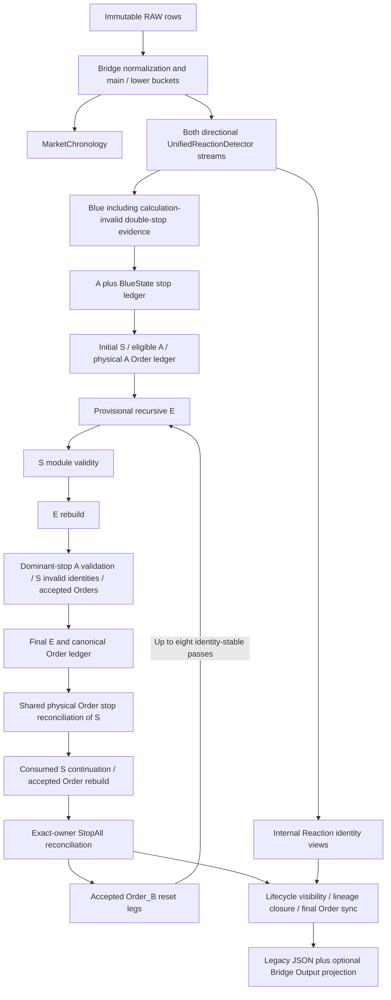

# Calculation dependency and ownership map

Snapshot: 2026-10-05, Asia/Tehran. Authority: user's audit instruction -> engine/engine.zip; all twelve packaged Python files equal live files. `source-map.json` inventories every class/function and static import with line bounds. This map precedes subsystem forensic analysis.

| Object / state | Creates and mutates | Invalidates / reconciles | Consumers / serializers |
|---|---|---|---|
| Candle / lower buckets | bridge.build_candle_buckets, build_candle_objects | supplied-input normalization | all detectors, MarketChronology |
| Reaction / Reset | reaction_engine.UnifiedReactionDetector | canonical directional state machine; cross-direction views classify internal | Blue/A/S/E/Order; bridge.serialize |
| Blue | blue_line_detector | calculation_valid and behavior_internal classification | A/S; bridge.serialize_blue_lines |
| A / BlueState | a_zone_detector | S eligibility; lifecycle dominant-stop validation | S, Order_B anchors, bridge.serialize_a_zones |
| S / eligible A / S Order ledger | s_zone_detector | lifecycle.s_zones_for_module_engines; dominant-stop invalidity; shared Order reconciliation | E, lifecycle, Order_B; bridge.serialize_s_zones |
| E / parent stop / physical Order ledger | e_zone_detector uses order_audit_engine | recursive family, same-source reconciliation, cause filtering, continuation rebuild | lifecycle/StopAll, Order_B, bridge.serialize_e_zones |
| Physical Order / creation cause / reset leg | order_audit_engine | accepted-parent cause validation; canonical membership; exact identity dedup | S/E, bridge.serialize_order_audit, optional projection |
| Dominant owner / armed count / StopAll | lifecycle_engine | higher-priority source transitions; exact direct-parent donor; hard resets | E sequence boundary, anchor discovery, visibility; bridge.serialize_stopalls |
| PipelineState and full stage snapshots | bridge.calculate_full_direction_state / prepare_pipeline_state | Order_B feedback and final visibility | build_direction_output, response serializer |
| Calculation range transport / cache | apps/chart server and Vite integration | input selection, fingerprint and content validation | Python CLI and frontend |

Verified orchestration: packaged/live bridge lines 1865-2349. Final projection and transport map receive separate audit passes. Derived ownership/index/cache state can persist in reused S detectors across feedback; that is a trace target, not yet a finding.

Authority gaps: no project TradingBot_AI_Operating_Protocol.md or project root AGENTS.md in current filesystem or index; user-supplied AGENTS rules and global AGENTS are available. Both current references list an absent bridge/__init__.py; pipeline/__init__.py is documented as a legacy unsupported wrapper. Existing Git index/worktree contains many pre-existing merge/delete states; audit does not repair or overwrite them.
