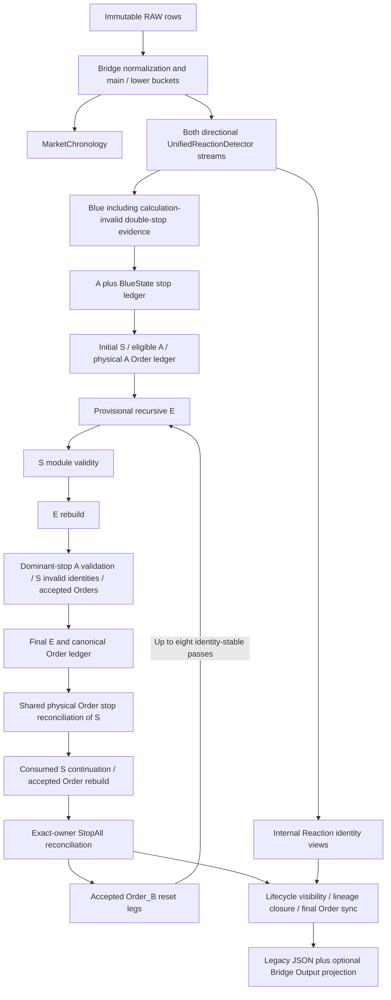

# TradingBot forensic audit — Current authoritative engine

Evidence date:2026-10-05–2026-10-06 · Asia/Tehran · READ-ONLY SOURCE / IMMUTABLE RAW · No fixes implemented.

## 1. Executive Summary

**Audit result: eight confirmed defects in active calculation, CLI, index or provenance contracts; two additional LOW scoped helper/unsupported-API defects; three HIGH-CONFIDENCE candidates.** Five of the eight active-path findings are HIGH, three are MEDIUM. No CRITICAL finding is established at the demonstrated downstream scope. The ten confirmed items are deliberately separated by category; a reproduced helper discrepancy is not reported as a proven erroneous trade.

The strongest final-output evidence is **SE-01**: four unique final-visible E rows select the wrong eligible physical Order when strict stop events tie, two per direction. **RX-01** omits an eligible canonical Reaction; **BL-01** consumes post-confirmation prices through two strike paths and demonstrably changes Blue/A calculation provenance. **RX-02** attaches an exact Reset to the wrong main bucket on supported sparse input. **BR-01** crashes a parser-accepted optional-module configuration on real RAW. The other three active-contract defects concern restored Order indexing, converted S direction and exact numeric JSON ingress.

The supplied XAUUSD Order_B causal diagnosis is **not confirmed under Current Source**. The target Order exists and invalid S ownership windows persist, but restoring the omitted A to eligibility does not make it accepted: native accepted Red E ownership independently rejects it. This was tested individually and in batch over two complete datasets, both directions and all three observed feedback passes. Extended merged history also preserves the target physical Order and E anchor; that is output continuity, not a second full eligibility refutation.

All eight requested phases were performed. Twelve packaged Python files, **12,735 lines and 395 AST definition nodes**, were fully inspected collectively; both complete Reference prose documents were covered. Eleven relevant chart/server files, **1,865 lines and 200 function nodes**, were fully reviewed. Fifteen original RAW files contain **2,615,072 supplied rows** (overlap included), and all were executed at 30 seconds in both directions. The full matrix contains **42 successful two-direction calculations / 84 direction calculations** across originals, extra 5/60-second runs, repeats and finest-history unions. Selected invariant checks produce **504 PASS results and no recorded failure**; these checks are bounded and coexist with the confirmed defects.

Production Source, `engine.zip`, both References and original RAW were not changed. All **51 protected byte hashes** are unchanged; all twelve package/live Source files match; pre-existing Git status and HEAD are unchanged outside the owned audit directory. No fix, commit, deployment or new trading rule is included.

Scope limits remain explicit: live HTTP/server/browser execution was NOT RUN; no complete corrected-engine counterfactual was implemented; exact normative decisions for the specification conflicts remain unresolved. Exhaustive correctness over every possible market history is INCOMPLETE. A finite audit cannot honestly promise that every possible bug has been found.

## 2. Project Snapshot

Snapshot began **2026-10-05** and completed **2026-10-06**, Asia/Tehran. Market examples use full local datetimes with `+03:30`. Artificial source probes are labeled and do not define production timestamps.

Authority follows the user's explicit rule: approved user/project instruction → Current packaged production Source → Current synchronized Reference prose → maintained docs → RAW facts → regression evidence → historical material → memory. `engine/engine.zip` is authoritative for this audit. Its SHA-256 is `7df1c37e43b17fed8f71815d65a11f208971999d4646d6db323213581ee60aba`. Extraction inventories **14 actual files: 12 Python files and 2 References**; directories and every archive member are in [package-inventory.json](D:/My-Projects/TradingBot/engineering/verification/forensic-audit-2026-10-05/package-inventory.json). All twelve actual Python files are byte-identical to their live counterparts. The preserved HEAD is `38a4bff50884765cf25a352a839b8213ec71409f`; the original worktree/index includes pre-existing unresolved/deleted states.

| Current module | Module version | Implementation version | Last-modified metadata | Lines |
|---|---|---|---|---|
| [engine/__init__.py](D:/My-Projects/TradingBot/engine/__init__.py) | unversioned | same / absent | absent | 0 |
| [engine/bridge/trading_pipeline.py](D:/My-Projects/TradingBot/engine/bridge/trading_pipeline.py) | 1.8.0 | 1.9.0 | 2026-09-30 12:00:00 +03:30 | 2957 |
| [engine/pipeline/__init__.py](D:/My-Projects/TradingBot/engine/pipeline/__init__.py) | unversioned | same / absent | absent | 19 |
| [engine/pipeline/a_zone_detector.py](D:/My-Projects/TradingBot/engine/pipeline/a_zone_detector.py) | 1.7.0 | same / absent | 2026-09-30 | 804 |
| [engine/pipeline/blue_line_detector.py](D:/My-Projects/TradingBot/engine/pipeline/blue_line_detector.py) | 2.4.0 | same / absent | absent | 458 |
| [engine/pipeline/core_utils.py](D:/My-Projects/TradingBot/engine/pipeline/core_utils.py) | 1.0.0 | same / absent | absent | 26 |
| [engine/pipeline/direction_policy.py](D:/My-Projects/TradingBot/engine/pipeline/direction_policy.py) | 1.0.0 | same / absent | absent | 70 |
| [engine/pipeline/e_zone_detector.py](D:/My-Projects/TradingBot/engine/pipeline/e_zone_detector.py) | 6.16.1 | 6.18.2 | 2026-10-03 14:32:06 +03:30 | 1140 |
| [engine/pipeline/lifecycle_engine.py](D:/My-Projects/TradingBot/engine/pipeline/lifecycle_engine.py) | 1.18.2 | 1.20.2 | 2026-10-04 21:25:23 +03:30 | 1439 |
| [engine/pipeline/order_audit_engine.py](D:/My-Projects/TradingBot/engine/pipeline/order_audit_engine.py) | 1.5.3 | same / absent | 2026-10-03 14:32:06 +03:30 | 1947 |
| [engine/pipeline/reaction_engine.py](D:/My-Projects/TradingBot/engine/pipeline/reaction_engine.py) | 9.8.0 | 9.9.0 | 2026-10-02 13:27:31 +03:30 | 2431 |
| [engine/pipeline/s_zone_detector.py](D:/My-Projects/TradingBot/engine/pipeline/s_zone_detector.py) | 4.20.0 | 4.21.0 | 2026-09-27 23:17:17 +03:30 | 1444 |

Current References are the packaged Bullish and Bearish **V5.4.24 Source_Synchronized** files, each 13,609 lines with 726 prose lines before embedded Source. Their exact paths/hashes are in [reference-inventory.json](D:/My-Projects/TradingBot/engineering/verification/forensic-audit-2026-10-05/reference-inventory.json). Embedded-code verification requires a distinction: **only the empty root is byte-exact**. Eleven nonempty embeds use CRLF versus actual LF; all twelve existing embeds are newline-normalized and AST-equal. Each Reference embeds a thirteenth file, `bridge/__init__.py`, absent from current package/live Source. Exact byte-sync and complete manifest assertions therefore FAIL, while semantic alignment of the twelve existing embeds PASS. No alternate embedded module was executed.

Repository-root `TradingBot_AI_Operating_Protocol.md` and `AGENTS.md` were unavailable in filesystem/index searches. The user pasted AGENTS instructions and the global AGENTS file were available; missing authority was recorded rather than invented. Some root/chart owner README files are also absent. Existing references retain older ZIP inventory and historical test claims; the current unit result is **81 passed, 2 xfailed**, not the carried 91 claim.

Runtime: Windows / PowerShell, Python **3.14.6**, Node **24.19.0**, orjson **3.12.0**, pytest **9.1.1**, tzdata **2026.3**. Decimal decisions use normalized exact strings downstream; the numeric JSON parser exception is NUM-JSON-01. All audit Python executions use `-B`, and pytest caching is disabled. Current main timeframe is an explicit integer number of seconds; the matrix uses 5, 30 and 60 seconds. Normal engine paths, all behavior flags, both direction streams and Bridge Output are supplied in the main matrix. Exact CLI arguments are preserved per manifest.

**Every original RAW input is inventoried below.** Index identifiers in findings resolve to these immutable exact paths. Gaps are preserved; duplicates/decreasing timestamps and malformed OHLC were checked. Rows include overlap and should not be called unique market events.

| Index | Immutable input | Nominal lower seconds | Rows | Actual first local | Actual last local |
|---|---|---|---|---|---|
| 0 | [RAW FXCM_USOIL 5S FROM 2026-08-21 04-00-00 TO 2026-09-29 11-46-20.json](<D:/My-Projects/TradingBot/apps/chart/state/data/RAW/BaseLine/RAW FXCM_USOIL 5S FROM 2026-08-21 04-00-00 TO 2026-09-29 11-46-20.json>) | 5 | 404809 | 2026-08-21T04:00:00+03:30 | 2026-09-29T11:46:20+03:30 |
| 1 | [RAW FARAZ_FOREXCOM_XAUUSD 1S FROM 1788449740 TO 1789388126.json](<D:/My-Projects/TradingBot/apps/chart/state/data/RAW/FOREXCOM/XAUUSD/RAW FARAZ_FOREXCOM_XAUUSD 1S FROM 1788449740 TO 1789388126.json>) | 1 | 621326 | 2026-09-03T19:05:40+03:30 | 2026-09-15T23:19:44+03:30 |
| 2 | [RAW FOREXCOM_XAUUSD 1S FROM 2026-09-03 19-05-40 TO 2026-09-08 03-18-28.json](<D:/My-Projects/TradingBot/apps/chart/state/data/RAW/FOREXCOM/XAUUSD/RAW FOREXCOM_XAUUSD 1S FROM 2026-09-03 19-05-40 TO 2026-09-08 03-18-28.json>) | 1 | 161376 | 2026-09-03T19:05:40+03:30 | 2026-09-08T03:18:28+03:30 |
| 3 | [RAW FOREXCOM_XAUUSD 30S FROM 2026-09-28 20-44-00 TO 2026-09-29 11-45-30.json](<D:/My-Projects/TradingBot/apps/chart/state/data/RAW/FOREXCOM/XAUUSD/RAW FOREXCOM_XAUUSD 30S FROM 2026-09-28 20-44-00 TO 2026-09-29 11-45-30.json>) | 30 | 1683 | 2026-09-28T20:44:00+03:30 | 2026-09-29T11:45:30+03:30 |
| 4 | [RAW FOREXCOM_XAUUSD 5S FROM 2026-08-25 03-53-30 TO 2026-09-23 18-01-15.json](<D:/My-Projects/TradingBot/apps/chart/state/data/RAW/FOREXCOM/XAUUSD/RAW FOREXCOM_XAUUSD 5S FROM 2026-08-25 03-53-30 TO 2026-09-23 18-01-15.json>) | 5 | 354698 | 2026-08-25T03:53:30+03:30 | 2026-09-23T18:01:15+03:30 |
| 5 | [RAW FOREXCOM_XAUUSD 5S FROM 2026-09-03 18-44-00 TO 2026-09-19 00-29-35.json](<D:/My-Projects/TradingBot/apps/chart/state/data/RAW/FOREXCOM/XAUUSD/RAW FOREXCOM_XAUUSD 5S FROM 2026-09-03 18-44-00 TO 2026-09-19 00-29-35.json>) | 5 | 183741 | 2026-09-03T18:44:00+03:30 | 2026-09-19T00:29:35+03:30 |
| 6 | [RAW FOREXCOM_XAUUSD 5S FROM 2026-09-16 22-35-00 TO 2026-09-17 19-15-35.json](<D:/My-Projects/TradingBot/apps/chart/state/data/RAW/FOREXCOM/XAUUSD/RAW FOREXCOM_XAUUSD 5S FROM 2026-09-16 22-35-00 TO 2026-09-17 19-15-35.json>) | 5 | 14140 | 2026-09-16T22:35:00+03:30 | 2026-09-17T19:15:35+03:30 |
| 7 | [RAW FOREXCOM_XAUUSD 5S FROM 2026-09-22 11-00-00 TO 2026-09-29 11-55-05.json](<D:/My-Projects/TradingBot/apps/chart/state/data/RAW/FOREXCOM/XAUUSD/RAW FOREXCOM_XAUUSD 5S FROM 2026-09-22 11-00-00 TO 2026-09-29 11-55-05.json>) | 5 | 83144 | 2026-09-22T11:00:00+03:30 | 2026-09-29T11:55:05+03:30 |
| 8 | [RAW FOREXCOM_XAUUSD 5S FROM 2026-09-28 20-44-00 TO 2026-10-03 00-29-35.json](<D:/My-Projects/TradingBot/apps/chart/state/data/RAW/FOREXCOM/XAUUSD/RAW FOREXCOM_XAUUSD 5S FROM 2026-09-28 20-44-00 TO 2026-10-03 00-29-35.json>) | 5 | 68492 | 2026-09-28T20:44:00+03:30 | 2026-10-03T00:29:35+03:30 |
| 9 | [RAW FOREXCOM_XAUUSD 5S FROM 2026-09-29 01-30-30 TO 2026-09-30 14-09-45.json](<D:/My-Projects/TradingBot/apps/chart/state/data/RAW/FOREXCOM/XAUUSD/RAW FOREXCOM_XAUUSD 5S FROM 2026-09-29 01-30-30 TO 2026-09-30 14-09-45.json>) | 5 | 25606 | 2026-09-29T01:30:30+03:30 | 2026-09-30T14:09:45+03:30 |
| 10 | [RAW FXCM_USOIL 5S FROM 2026-08-21 04-00-00 TO 2026-10-02 16-35-20.json](<D:/My-Projects/TradingBot/apps/chart/state/data/RAW/FXCM/USOIL/RAW FXCM_USOIL 5S FROM 2026-08-21 04-00-00 TO 2026-10-02 16-35-20.json>) | 5 | 452814 | 2026-08-21T04:00:00+03:30 | 2026-10-02T16:35:20+03:30 |
| 11 | [RAW FXCM_USOIL 5S FROM 2026-09-11 02-53-30 TO 2026-09-15 11-03-45.json](<D:/My-Projects/TradingBot/apps/chart/state/data/RAW/FXCM/USOIL/RAW FXCM_USOIL 5S FROM 2026-09-11 02-53-30 TO 2026-09-15 11-03-45.json>) | 5 | 36821 | 2026-09-11T02:53:30+03:30 | 2026-09-15T11:03:45+03:30 |
| 12 | [RAW FXCM_USOIL 5S FROM 2026-09-21 22-50-00 TO 2026-09-24 00-26-20.json](<D:/My-Projects/TradingBot/apps/chart/state/data/RAW/FXCM/USOIL/RAW FXCM_USOIL 5S FROM 2026-09-21 22-50-00 TO 2026-09-24 00-26-20.json>) | 5 | 30935 | 2026-09-21T22:50:00+03:30 | 2026-09-24T00:26:20+03:30 |
| 13 | [RAW FXCM_USOIL 5S FROM 2026-09-21 22-54-30 TO 2026-09-29 10-51-55.json](<D:/My-Projects/TradingBot/apps/chart/state/data/RAW/FXCM/USOIL/RAW FXCM_USOIL 5S FROM 2026-09-21 22-54-30 TO 2026-09-29 10-51-55.json>) | 5 | 81954 | 2026-09-21T22:54:30+03:30 | 2026-09-29T10:51:55+03:30 |
| 14 | [RAW FXCM_USOIL 5S FROM 2026-09-24 19-30-00 TO 2026-10-03 00-14-55.json](<D:/My-Projects/TradingBot/apps/chart/state/data/RAW/FXCM/USOIL/RAW FXCM_USOIL 5S FROM 2026-09-24 19-30-00 TO 2026-10-03 00-14-55.json>) | 5 | 93533 | 2026-09-24T19:30:00+03:30 | 2026-10-03T00:14:55+03:30 |

[raw-registry.json](D:/My-Projects/TradingBot/engineering/verification/forensic-audit-2026-10-05/raw-registry.json) records SHA-256, metadata, intervals, first/last rows and step distributions. One epoch-style 1-second filename understates its actual endpoint; actual rows reach 2026-09-15 23:19:44+03:30. Coverage is determined from rows, not filenames. The two XAU 1-second files overlap with an identical peer prefix. All same-granularity peer comparisons found zero conflicting rows.

Two additional audit-only derived inputs preserve original rows with explicit precedence/provenance: USOIL **458,231 rows**, XAUUSD **962,880 rows**, extending the available continuous history through October 3. XAU uses 1-second rows throughout their physical interval and 5-second rows outside it; no candle was invented and no original was rewritten. Their hashes/input list/method are in [finest-union-registry.json](D:/My-Projects/TradingBot/engineering/verification/forensic-audit-2026-10-05/finest-union-registry.json); each ran at30/60s in both directions. Cross-granularity compatibility is reported separately in section11.

## 3. Architecture / Dependency Map

| Object / state | Creates and mutates | Invalidates / reconciles | Consumers / serializers |
|---|---|---|---|
| Candle / lower buckets | bridge.build_candle_buckets, build_candle_objects | supplied-input normalization | all detectors, MarketChronology |
| Reaction / Reset | reaction_engine.UnifiedReactionDetector | canonical directional state machine; cross-direction views classify internal | Blue/A/S/E/Order; bridge.serialize |
| Blue | blue_line_detector | calculation_valid and behavior_internal classification | A/S; bridge.serialize_blue_lines |
| A / BlueState | a_zone_detector | S eligibility; lifecycle dominant-stop validation | S, Order_B anchors, bridge.serialize_a_zones |
| S / eligible A / S Order ledger | s_zone_detector | lifecycle.s_zones_for_module_engines; dominant-stop invalidity; shared Order reconciliation | E, lifecycle, Order_B; bridge.serialize_s_zones |
| E / parent stop / physical Order ledger | e_zone_detector uses order_audit_engine | recursive family, same-source reconciliation, cause filtering, continuation rebuild | lifecycle/StopAll, Order_B, bridge.serialize_e_zones |
| Physical Order / creation cause / reset leg | order_audit_engine | accepted-parent cause validation; canonical membership; exact identity dedup | S/E, bridge.serialize_order_audit, optional projection |
| Dominant owner / armed count / StopAll | lifecycle_engine | higher-priority source transitions; exact direct-parent donor; hard resets | E sequence boundary, anchor discovery, visibility; bridge.serialize_stopalls |
| PipelineState and full stage snapshots | bridge.calculate_full_direction_state / prepare_pipeline_state | Order_B feedback and final visibility | build_direction_output, response serializer |
| Calculation range transport / cache | apps/chart server and Vite integration | input selection, fingerprint and content validation | Python CLI and frontend |

Verified orchestration: packaged/live bridge lines 1865-2349. Final projection and transport map receive separate audit passes. Derived ownership/index/cache state can persist in reused S detectors across feedback; that is a trace target, not yet a finding.

The bridge always constructs both canonical directional Reaction streams needed for physical opposite Order identity. Public/internal classification and presentation are later stages. Accepted lifecycle cause rebuilding and Order_B reset-leg feedback are semantic stages, not serializer corrections. Feedback permits at most eight identity-stable passes; both deeply observed RAW traces converged after three. Frozen dataclasses hold behavior geometry, while detector-owned maps/sets carry accepted causes, source/index and reset boundaries.

Ownership closure and every Python import/definition bound are in [source-map.json](D:/My-Projects/TradingBot/engineering/verification/forensic-audit-2026-10-05/source-map.json); [ARCHITECTURE.md](D:/My-Projects/TradingBot/engineering/verification/forensic-audit-2026-10-05/ARCHITECTURE.md) is the pre-analysis map. The chart transport owns source selection, content/source fingerprinting and request execution; the Python engine owns trading state. Complete-source HTTP requests use original RAW; selected-range requests deliberately start a cold calculation from selected inclusive chart buckets under Reference L47. CLI display bounds are applied after complete supplied-input calculation.

## 4. Audit Coverage

Study statuses and verification statuses are different claims. `READ_FULL` means complete inspection, `VERIFIED_DUPLICATE` means identical already-read text, `INVENTORIED` means listed/routed, and `NOT_READ` means no complete inspection. Execution uses only PASS / FAIL / NOT RUN / INCOMPLETE.

| Area | Study coverage | Concrete scope | Limit / owner |
|---|---|---|---|
| Engine Python | READ_FULL | All12 files;12,735 lines;395 AST class/function/closure nodes | Parent bridge/Order + Reaction/Blue/A + S/E + lifecycle partition |
| Both current References | READ_FULL / VERIFIED_DUPLICATE | Both726-line prose spans; identical mirrored portions verified, every differing line reviewed | Embedded12 Source texts/ASTs verified, not a second rule authority |
| Chart calculation boundary | READ_FULL | 11files;1,865lines;200functionnodes | Complete Vite orchestration and directly relevant transport/cache/state callees |
| Relevant engine tests | READ_FULL / executed | StopAll dominance; Order lifecycle contracts; HPZR reporter unit tests; RAW Order_B verifier | Existing expected failures preserved |
| Relevant chart tests | READ_FULL / executed | Four boundary unit files fully read; all chart unit files executed | 78passed; no live endpoint/browser certification |
| Project files / manifests / historical anchors | INVENTORIED / targeted READ_FULL | Initial project-file inventory1176 entries; source/version metadata, package, current config and referenced regression evidence | Historical source copies under verification/archive are supporting evidence |
| Frontend rendering, unrelated ingestion/release tools and all archives | INVENTORIED / NOT_READ outside semantic closure | Imports and paths routed; no claim of complete code review for unrelated UI/release modules | No effect inferred without a current engine dependency |

| Recorded matrix | Two-direction runs | Main seconds | Execution counts | Observed total wall seconds |
|---|---|---|---|---|
| raw-30s | 15 | [30] | {'PASS': 15} | 829.17 |
| raw-60s | 8 | [60] | {'PASS': 8} | 130.52 |
| raw-5s | 3 | [5] | {'PASS': 3} | 107.5 |
| determinism | 12 | [30] | {'PASS': 12} | 73.1 |
| finest-union | 4 | [30, 60] | {'PASS': 4} | 577.5 |

The thirty base matrix calculations comprise15 original30s +8 original60s +3 original5s +4 merged30/60s. Twelve additional calculations are three repetitions on each of four30s inputs, giving eight comparisons against a prior run. All stable fields, including dictionary/list order, Decimal strings, visibility, event/source times and provenance, were retained; only top-level observational `timings` was removed. Stable bytes and parsed objects both compare equal.

Deep lifecycle observation used complete idx8 andidx14 RAW, both directions and all observed feedback passes, plus a separate same-output E tie trace onidx8. The hooks call original functions and return original objects unchanged. Traced stable outputs equal the uninstrumented payloads. Hooks existed only in isolated diagnostic processes and were removed when those processes ended; production files were never instrumented. Standalone diagnostic scripts/evidence remain for reproducibility.

Tests: engine units **81passed,2xfailed**; chart units **78passed**; forced expected-failure run **2failed,37deselected**; package-authoritative focused contracts **79passed,2xfailed**. Reaction differential checks include2,000 lower-index assertions and1,500 valid synthetic reflected histories/3,000 directional Reaction→Blue→A executions. Whole-runtime reflection checks **16 PASS** stage/direction comparisons on a1,200-main/7,200-lower synthetic history, deliberately without Dojis. Projection probes cover exact event/equality/horizon/source identity and immutability; boundary probes cover500 sparse inputs/2,500 range assertions and queue/cache/source guard behavior.

All filenames and commands are preserved in [coverage-ledger.json](D:/My-Projects/TradingBot/engineering/verification/forensic-audit-2026-10-05/coverage-ledger.json), manifests and logs. Full algorithm correctness, every possible post-fix downstream consequence, live HTTP/browser execution and historical before/after Source differential are not claimed. The requested audit phases are complete as performed work; these evidence limits remain INCOMPLETE or NOT RUN in section20.

## 5. Confirmed Bugs

Confirmed means the stated incorrect behavior was reproduced and the owning divergence established. Severity applies to that demonstrated scope. The first eight findings are active calculation, CLI, index or provenance defects; the final two LOW findings are explicitly narrower engineering/API defects. Synthetic cases prove general supported input transitions but do not establish real-market prevalence. Every requested bug field is below; machine-readable equivalent: [findings.json](D:/My-Projects/TradingBot/engineering/verification/forensic-audit-2026-10-05/findings.json).

| ID | Severity | Category | Strongest demonstrated scope |
|---|---|---|---|
| RX-01 | HIGH | Calculation implementation | Initial confirmed Reaction omits eligible confirmation-candle continuation |
| BL-01 | HIGH | Calculation chronology | Two Scale strike paths consume Break-candle extrema after exact confirmation |
| SE-01 | HIGH | Calculation selection | E route reduction discards the required later First on equal Order stop |
| RX-02 | HIGH | Calculation chronology | Sparse first buckets inflate Reaction timeframe and misassign Reset ownership |
| BR-01 | HIGH | CLI orchestration | Accepted optional StopAll-engine omission causes feedback/final mismatch crash |
| OA-INDEX-01 | MEDIUM | State/index integrity | Restored accepted Order ledger rows lack the confirmation secondary index |
| SE-02 | MEDIUM | Conditional provenance/schema | Shared Order reconciliation leaves converted Red S with null Order direction |
| NUM-JSON-01 | MEDIUM | Input numeric precision | Numeric JSON loses exact OHLC distinctions before Decimal normalization |
| LC-01 | LOW | Scoped documented-helper defect; trading impact unproven | S-transition visibility helper maps intrabar event to the next main candle |
| API-LEGACY-01 | LOW | Unsupported legacy API defect; not production trading | Legacy pipeline package wrapper imports a missing symbol |

### RX-01 — Initial confirmed Reaction omits eligible confirmation-candle continuation

**BUG ID:** RX-01

**TITLE:** Initial confirmed Reaction omits eligible confirmation-candle continuation

**SEVERITY:** HIGH

**CONFIDENCE:** CONFIRMED

**DIRECTION:** Both

**CATEGORY:** Calculation implementation

**AFFECTED MODULE(S):** [engine/pipeline/reaction_engine.py](D:/My-Projects/TradingBot/engine/pipeline/reaction_engine.py)

**AFFECTED VERSION(S):** pipeline/reaction_engine.py: REACTION_ENGINE_VERSION=9.8.0; REACTION_ENGINE_IMPLEMENTATION_VERSION=9.9.0; REACTION_ENGINE_LAST_MODIFIED=2026-10-02 13:27:31 +03:30

**FUNCTION / METHOD:** UnifiedReactionDetector.detect; _candidate_from_confirmation_remainder

**TRIGGER CONDITIONS:** The initial confirmed Reaction has a Break main candle with the required next First color, a qualifying confirmation remainder, no post-confirmation Reset, and a later strict confirmation.

**EXPECTED BEHAVIOR:** Apply the normal confirmation remainder transition to the initial confirmation and admit its eligible next Mode B candidate.

**ACTUAL BEHAVIOR:** Initial detection starts at BreakIndex+1 with candidate=None, so the eligible Break-candle First is absent from canonical Reactions.

**FIRST DIFF:** Immediately after initial confirmation, next candidate should own First=BreakIndex; actual candidate is None, before Blue or lifecycle execution.

**ROOT CAUSE:** The initial-state branch omits the shared remainder-seeding call that all later confirmation branches perform.

**STATE CHAIN:** RAW -> initial Reaction strict confirmation -> remainder First -> missing canonical identity -> downstream canonical consumers.

**RAW EVIDENCE:** Original idx6 XAUUSD 14,140 five-second rows at main30s. Bullish First 2026-09-16 22:42:00, Break22:44:00, confirmation22:44:05 +03:30. Eligible continuation (First18,Break19) confirms in main22:44:30; box4249.81/4244.635. Canonical identity(18,19) is missing. Bearish market occurrence not independently established.

**SOURCE EVIDENCE:** reaction_engine.py:2148-2157 and2183-2195; contrasting shared calls2308,2349,2387 and contract1589.

**ALGORITHM REFERENCE:** Both V5.4.24 §4.4 L80 permit confirmation-candle reuse; Source shared-state contract says every confirmation opens Normal search. Newline-normalized embedded Source preserves the same omission. Current Source has precedence, but its inconsistent transition plus reproduced eligible continuation support implementation-defect classification.

**DOWNSTREAM IMPACT:** Canonical membership and numbering are incorrect. Missing Reaction can alter Blue/A/Order discovery. Exact accepted trade, S/E/StopAll consequences were not counterfactually executed.

**MIRROR IMPACT:** Both valid synthetic reflections omit(2,3): actual[(1,2)] versus expected[(1,2),(2,3)].

**REPRODUCTION:** python -B engineering/verification/forensic-audit-2026-10-05/reaction-audit/probes.py; then python -B engineering/verification/forensic-audit-2026-10-05/reaction-audit/raw_probes.py. See reaction-audit/probe-evidence.json and reaction-audit/raw-evidence.json.

**GENERAL FIX DIRECTION:** Correct the initial Reaction state transition in its owning detector using the same general confirmation remainder contract, preserving exact Reset precedence.

**REGRESSION TEST REQUIRED:** Both directions, confirmation reused with/without Reset, equality boundary, initial versus later confirmation parity, then full-engine first-divergence regression on real input.

### BL-01 — Two Scale strike paths consume Break-candle extrema after exact confirmation

**BUG ID:** BL-01

**TITLE:** Two Scale strike paths consume Break-candle extrema after exact confirmation

**SEVERITY:** HIGH

**CONFIDENCE:** CONFIRMED

**DIRECTION:** Both

**CATEGORY:** Calculation chronology

**AFFECTED MODULE(S):** [engine/pipeline/blue_line_detector.py](D:/My-Projects/TradingBot/engine/pipeline/blue_line_detector.py)

**AFFECTED VERSION(S):** pipeline/blue_line_detector.py: BLUE_LINE_VERSION=2.4.0

**FUNCTION / METHOD:** count_scale_strikes; _intrabar_pending_confirmation

**TRIGGER CONDITIONS:** A Break main candle reaches its eligible directional extreme after its first exact Reaction confirmation; either the main candle has confirming color or no eligible strike existed at first confirmation.

**EXPECTED BEHAVIOR:** Limit Break strike evidence through the first exact confirmation lower row, inclusive, independently of pending strike eligibility.

**ACTUAL BEHAVIOR:** Full-main pending extrema can confirm directly; the lower loop also continues after first strict confirmation when eligible is empty.

**FIRST DIFF:** Pending/strike state first includes an extreme attained after the owning Reaction confirmation. The divergence precedes scale spacing and public filtering.

**ROOT CAUSE:** The full-main confirming-color shortcut bypasses the lower cutoff; the lower helper uses breaks AND eligible instead of an unconditional owning-Reaction confirmation boundary.

**STATE CHAIN:** RAW exact confirmation -> later Break extreme -> wrong strike/source state -> Blue calculation provenance -> A Blue-2 provenance.

**RAW EVIDENCE:** Five real idx6/idx9 cases are recorded in reaction-audit/REPORT.md. Example Bullish Reaction58: main2026-09-17 05:30:30 confirms05:30:35, eligible Low4299.06, actual strike4298.815 first attained05:30:45 +03:30. Example Bearish Reaction42: 2026-09-29 07:00:00 confirms07:00:00, eligible High4139.515, later actual4140.305 at07:00:20. None immediately emits a Scale Blue due separate spacing suppression.

**SOURCE EVIDENCE:** blue_line_detector.py:162-188 and103-135; strict termination conditional at118.

**ALGORITHM REFERENCE:** Both V5.4.24 §5.2 L106 and reconstruction row617 cap Break intrabar confirmation. Higher-authority Source is internally inconsistent with exact Reaction chronology; independently reproduced in both branches.

**DOWNSTREAM IMPACT:** Bounded eligibility oracle changes Bearish Blue ordinal146 source from2026-09-30 03:23:00/index2984/line4184.93 to03:22:30/index2983/line4184.305. A ordinal50 inherits changed Blue-2 source; its price4187.69/source03:26:30 stay equal. The Blue is internal, but its A consumer demonstrates calculation propagation. Final public A/S/E/trade counterfactual NOT RUN.

**MIRROR IMPACT:** Both branches reproduce both directions. Pre-confirmation Low9.1 stays aboveFib8.764; laterLow5 at12:01:15 leaks afterconfirmation12:01:00. Reflected High-5 leaks likewise.

**REPRODUCTION:** python -B engineering/verification/forensic-audit-2026-10-05/reaction-audit/probes.py; then python -B engineering/verification/forensic-audit-2026-10-05/reaction-audit/raw_probes.py. The oracle runs in a separate namespace and never changes production globals or RAW.

**GENERAL FIX DIRECTION:** Enforce exact Break cutoff in the Blue strike owner for every entry path; preserve earlier eligible extreme ownership and strict first-equal source semantics.

**REGRESSION TEST REQUIRED:** Confirming-color and pending-intrabar paths, empty eligible at first break, same-row inclusivity, later equal extreme, both mirrors, full pipeline provenance comparisons.

### SE-01 — E route reduction discards the required later First on equal Order stop

**BUG ID:** SE-01

**TITLE:** E route reduction discards the required later First on equal Order stop

**SEVERITY:** HIGH

**CONFIDENCE:** CONFIRMED

**DIRECTION:** Both

**CATEGORY:** Calculation selection

**AFFECTED MODULE(S):** [engine/pipeline/e_zone_detector.py](D:/My-Projects/TradingBot/engine/pipeline/e_zone_detector.py); [engine/pipeline/order_audit_engine.py](D:/My-Projects/TradingBot/engine/pipeline/order_audit_engine.py)

**AFFECTED VERSION(S):** pipeline/e_zone_detector.py: E_ZONE_VERSION=6.16.1; E_ZONE_IMPLEMENTATION_VERSION=6.18.2; E_ZONE_LAST_MODIFIED=2026-10-03 14:32:06 +03:30; pipeline/order_audit_engine.py: ORDER_AUDIT_ENGINE_VERSION=1.5.3; ORDER_AUDIT_ENGINE_LAST_MODIFIED=2026-10-03 14:32:06 +03:30

**FUNCTION / METHOD:** EZoneDetector._zone; OrderAuditEngineMixin.order_candidates; _first_order; _post_stop_accepted_orders_for_parent

**TRIGGER CONDITIONS:** Multiple eligible canonical physical Orders in the same E parent branch have the identical first strict Order-stop event and different First indices.

**EXPECTED BEHAVIOR:** For E consumption choose earliest exact stop, then larger FirstIndex for a true stop tie, across all eligible routes.

**ACTUAL BEHAVIOR:** Route-specific selection retains an earlier First before the final correct tie key executes.

**FIRST DIFF:** The native order_candidates pool contains both identities, but _first_order/other one-member route reductions discard the later First. E final (stop,-First) cannot recover it.

**ROOT CAUSE:** Creation ordering by confirmation/ascending First is reused during consumption; inconsistent minima are computed before global E adjudication.

**STATE CHAIN:** Canonical direct-parent and accepted reset-leg Orders -> same exact stop -> early route minimum -> E construction with wrong Order -> final-visible E geometry/provenance.

**RAW EVIDENCE:** idx8 complete XAUUSD 68,492 five-second rows main30s: four unique final-visible rows, two per direction. Bull RedE5 source2026-09-29 21:28:00, parentstop21:10:05, selected(2825,2839) confirms21:24:15 versus eligible(2841,2847) confirms21:28:25; exact stop21:30:00 both. Actual A/250 box4146.525/4143.415 stop4147.6 versus required B/251 box4143.7/4142.71 stop4146.525. Other cases: BullBlueE1 2026-09-30 12:37:30; BearBlueE1 2026-09-29 21:03:30; BearRedE4 2026-10-02 08:02:00, all +03:30.

**SOURCE EVIDENCE:** E:391-418 retains route[0]; Order:830-856 uses ascending FirstTime and first result; post-stop route1366-1374 ranks confirmation ahead of later First.

**ALGORITHM REFERENCE:** Both V5.4.24 §8.2 L185-187 and E matrixrow620 require larger FirstIndex after equal stop. §9.1 earliest confirmation is the separate physical creation rule, not E consumption. Source precedence is recorded; native same-pool eligibility and inconsistent final key establish an implementation error.

**DOWNSTREAM IMPACT:** Four final E rows select wrong Order identity/mode/number/box/stop. Twenty unique physical branch conflicts were traced;334 route observations/324 survivors/52 provisional variants are NOT final defect counts. Subsequent accepted orders after correcting E were not simulated.

**MIRROR IMPACT:** Both mirrored synthetic probes and two real final E cases in each direction.

**REPRODUCTION:** python -B engineering/verification/forensic-audit-2026-10-05/trace_pipeline.py --raw-index 8 --timeframe 30 --order-ties; then python -B engineering/verification/forensic-audit-2026-10-05/s-e-audit/raw_tie_analysis.py. s-e-audit/RAW-tie-confirmation.json verifies native pool eligibility, exact stop tie and final-output joins. Traced stable payload equals uninstrumented payload.

**GENERAL FIX DIRECTION:** Own the E consumption comparator over the complete eligible physical set; ensure each route uses that same minimum before reducing. Preserve independent creation/one-parent-stop rules.

**REGRESSION TEST REQUIRED:** Direct parent versus reset leg, inherited/carried/post-stop routes, equal stop with unequal confirmations, two directions, exact final E identity and geometry, repeated stable rebuild.

### RX-02 — Sparse first buckets inflate Reaction timeframe and misassign Reset ownership

**BUG ID:** RX-02

**TITLE:** Sparse first buckets inflate Reaction timeframe and misassign Reset ownership

**SEVERITY:** HIGH

**CONFIDENCE:** CONFIRMED

**DIRECTION:** Both

**CATEGORY:** Calculation chronology

**AFFECTED MODULE(S):** [engine/pipeline/reaction_engine.py](D:/My-Projects/TradingBot/engine/pipeline/reaction_engine.py); [engine/bridge/trading_pipeline.py](D:/My-Projects/TradingBot/engine/bridge/trading_pipeline.py)

**AFFECTED VERSION(S):** pipeline/reaction_engine.py: REACTION_ENGINE_VERSION=9.8.0; REACTION_ENGINE_IMPLEMENTATION_VERSION=9.9.0; REACTION_ENGINE_LAST_MODIFIED=2026-10-02 13:27:31 +03:30; bridge/trading_pipeline.py: TRADING_PIPELINE_VERSION=1.8.0; TRADING_PIPELINE_IMPLEMENTATION_VERSION=1.9.0; TRADING_PIPELINE_LAST_MODIFIED=2026-09-30 12:00:00 +03:30

**FUNCTION / METHOD:** DetectorBase.__init__; post_breakout_reset; UnifiedReactionDetector.detect; build_candle_buckets

**TRIGGER CONDITIONS:** Valid supplied main buckets omit an empty bucket between the first two occupied starts, so their gap exceeds the requested main timeframe.

**EXPECTED BEHAVIOR:** Use the explicit requested timeframe for each half-open main/lower window and map the exact Reset to its containing main bucket.

**ACTUAL BEHAVIOR:** DetectorBase infers the larger first occupied gap as timeframe; confirmation remainder scans into a later main candle and assigns its Reset to the previous index.

**FIRST DIFF:** Detector initialization has timeframe60 while request/MarketChronology have30; first observable Reset then uses index2 instead of3.

**ROOT CAUSE:** Timeframe metadata is inferred from occupancy rather than passed consistently through the calculation context.

**STATE CHAIN:** Accepted sparse transport -> 30s bucket list with a60s first gap -> inferred60 detector -> overlong lower window -> wrong Reset main identity.

**RAW EVIDENCE:** Synthetic consistent occupied30s starts2026-10-05 12:00:00,12:01:00,12:01:30,12:02:00; six5s rows per occupied candle. Exact Reset12:02:00 is attached to main12:01:30/index2 instead of12:02:00/index3. These dates identify the probe only, not production rules. No original RAW prefix case was established.

**SOURCE EVIDENCE:** Reaction:121-124; post_breakout_reset278-283 and Unified2174-2193. Bridge164-177 preserves sparse occupancy and MarketChronology1749-1750 receives explicit timeframe.

**ALGORITHM REFERENCE:** Both V5.4.24 global chronology L56/§4.6 L88 require correct owning main and exact event order. Selected-range contract L47 and audited chart transport explicitly preserve missing buckets; the fixture is an accepted input shape.

**DOWNSTREAM IMPACT:** Reset identity/time and subsequent search boundaries can be wrong across the stream. Full accepted trade counterfactual NOT RUN; real supplied RAW-prefix incidence unproven.

**MIRROR IMPACT:** Both directions reproduce the same owner misassignment; range boundary independently validated by500 sparse histories/2500 assertions.

**REPRODUCTION:** python -B engineering/verification/forensic-audit-2026-10-05/reaction-audit/probes.py; see boundary-audit/REPORT.md and its executable probe for transport acceptance.

**GENERAL FIX DIRECTION:** Own timeframe in the run context and pass it to Reaction/lower-window consumers; never infer duration from occupied timestamps.

**REGRESSION TEST REQUIRED:** Sparse prefix/middle gaps, cold selected range, complete-source range, one-candle input,30/60s, exact bucket boundary, mirrors; assert event belongs to declared half-open bucket.

### BR-01 — Accepted optional StopAll-engine omission causes feedback/final mismatch crash

**BUG ID:** BR-01

**TITLE:** Accepted optional StopAll-engine omission causes feedback/final mismatch crash

**SEVERITY:** HIGH

**CONFIDENCE:** CONFIRMED

**DIRECTION:** Direction-invariant

**CATEGORY:** CLI orchestration

**AFFECTED MODULE(S):** [engine/bridge/trading_pipeline.py](D:/My-Projects/TradingBot/engine/bridge/trading_pipeline.py)

**AFFECTED VERSION(S):** bridge/trading_pipeline.py: TRADING_PIPELINE_VERSION=1.8.0; TRADING_PIPELINE_IMPLEMENTATION_VERSION=1.9.0; TRADING_PIPELINE_LAST_MODIFIED=2026-09-30 12:00:00 +03:30

**FUNCTION / METHOD:** parse_arguments; load_engines; calculate_direction_with_order_b_feedback; finalize_direction_visibility

**TRIGGER CONDITIONS:** Valid RAW with E/Order_B activity is calculated while optional --lifecycle-engine/--stopall-engine is omitted.

**EXPECTED BEHAVIOR:** One effective enablement decision must be used in feedback and final visibility; every parser-accepted supported configuration should complete consistently.

**ACTUAL BEHAVIOR:** Fallback loads lifecycle and feedback uses StopAll, but final visibility gates it on the absent explicit argument, then crashes comparing accepted reset-leg identities.

**FIRST DIFF:** StopAll participation diverges between feedback input at2203 and final gate2511 before identity comparison2559.

**ROOT CAUSE:** Effective module loading/default state is not the configuration authority for every orchestration stage.

**STATE CHAIN:** CLI omission -> fallback lifecycle -> feedback StopAll -> accepted Order_B identities -> empty final StopAll -> different identities -> RuntimeError.

**RAW EVIDENCE:** idx6 XAUUSD 14,140 valid5s rows main30s, both directions. Explicit-path control exits0; omitted-path exits1 with error Final Order_B lifecycle causes differ from converged E feedback.

**SOURCE EVIDENCE:** Bridge1635-1640 optional parser;1694-1699 fallback;2203-2219 unconditional feedback;2511-2519 conditional final;2559-2562 invariant failure.

**ALGORITHM REFERENCE:** V5.4.24 §13.3 enablement fields do not decide default-on versus default-off. Either interpretation requires consistent stage inputs; the crash is confirmed without inventing a trading default.

**DOWNSTREAM IMPACT:** The accepted CLI configuration produces no successful calculation payload. Normal explicit-path production matrix succeeds.

**MIRROR IMPACT:** Direction-invariant orchestration defect; command --direction both reproduces.

**REPRODUCTION:** python -B engineering/verification/forensic-audit-2026-10-05/check_configurations.py; exact CLI/path/RAW/flags preserved in configurations/manifest.json; error file without-stopall-engine.stdout.json.

**GENERAL FIX DIRECTION:** Resolve effective lifecycle enablement once in the bridge and reuse it throughout feedback/finalization; select and document the optional default before repair.

**REGRESSION TEST REQUIRED:** Explicit/omitted module paths, E on/off, both and separate directions, histories with/without StopAll and reset legs; assert converged and final identities match.

### OA-INDEX-01 — Restored accepted Order ledger rows lack the confirmation secondary index

**BUG ID:** OA-INDEX-01

**TITLE:** Restored accepted Order ledger rows lack the confirmation secondary index

**SEVERITY:** MEDIUM

**CONFIDENCE:** CONFIRMED

**DIRECTION:** Both

**CATEGORY:** State/index integrity

**AFFECTED MODULE(S):** [engine/pipeline/order_audit_engine.py](D:/My-Projects/TradingBot/engine/pipeline/order_audit_engine.py)

**AFFECTED VERSION(S):** pipeline/order_audit_engine.py: ORDER_AUDIT_ENGINE_VERSION=1.5.3; ORDER_AUDIT_ENGINE_LAST_MODIFIED=2026-10-03 14:32:06 +03:30

**FUNCTION / METHOD:** ensure_accepted_order_audit; _rebuild_accepted_order_audit; _accepted_post_stop_orders_after

**TRIGGER CONDITIONS:** An accepted historical/reset-leg physical Order is preserved, absent from the rebuilt subset, and merged back after a ledger rebuild.

**EXPECTED BEHAVIOR:** Every retained eligible ledger identity must be discoverable through the same confirmation index used by accepted post-stop queries.

**ACTUAL BEHAVIOR:** setdefault restores the row but not its confirmation index; query returns[] although identity(5,6) exists in the ledger.

**FIRST DIFF:** At the restoration merge, ledger membership becomes populated while the rebuilt confirmation index remains missing the identity.

**ROOT CAUSE:** A mutation of canonical state updates only one of its coupled structures; cache invalidation alone does not populate the secondary index.

**STATE CHAIN:** Accepted ledger -> rebuild clears/reindexes subset -> preserved identity merged -> index omission -> accepted post-stop E query misses it.

**RAW EVIDENCE:** Source-level both-direction fixture is the existing strict xfail; actual market loss was not established. Current direct order_b_legs scanning may mask this in common full-pipeline paths.

**SOURCE EVIDENCE:** Order1590-1611 preserves and setdefaults; query1340-1374 relies on confirmation index; compare normal _index_order_audit_identity path. Existing test_order_audit_lifecycle_contracts.py:266-286.

**ALGORITHM REFERENCE:** Reference §11/§13 identity and accepted physical ledger requirements; decisive evidence is existing explicit desired-query regression plus canonical/index inconsistency. No novel market rule is required.

**DOWNSTREAM IMPACT:** Accepted physical evidence is unavailable to this query. A general final-output corruption claim is unproven; two expected failures already describe this defect.

**MIRROR IMPACT:** Existing paired strict expected failures reproduce both directions.

**REPRODUCTION:** python -B -m pytest -q engine/tests/unit/test_order_audit_lifecycle_contracts.py -k ensure_restored --runxfail -p no:cacheprovider ->2 failed,37 deselected; restored-index-failures.log.

**GENERAL FIX DIRECTION:** Restore ledger and all semantic indexes atomically through the canonical registration owner; preserve history and invalidate dependent caches together.

**REGRESSION TEST REQUIRED:** Rebuild then restore, repeated ensure, ledger/query equivalence, no duplicates, both directions, restored active/inactive legs, full-engine route reachability.

### SE-02 — Shared Order reconciliation leaves converted Red S with null Order direction

**BUG ID:** SE-02

**TITLE:** Shared Order reconciliation leaves converted Red S with null Order direction

**SEVERITY:** MEDIUM

**CONFIDENCE:** CONFIRMED

**DIRECTION:** Both

**CATEGORY:** Conditional provenance/schema

**AFFECTED MODULE(S):** [engine/pipeline/s_zone_detector.py](D:/My-Projects/TradingBot/engine/pipeline/s_zone_detector.py); [engine/bridge/trading_pipeline.py](D:/My-Projects/TradingBot/engine/bridge/trading_pipeline.py)

**AFFECTED VERSION(S):** pipeline/s_zone_detector.py: S_ZONE_VERSION=4.20.0; S_ZONE_IMPLEMENTATION_VERSION=4.21.0; S_ZONE_LAST_MODIFIED=2026-09-27 23:17:17 +03:30; bridge/trading_pipeline.py: TRADING_PIPELINE_VERSION=1.8.0; TRADING_PIPELINE_IMPLEMENTATION_VERSION=1.9.0; TRADING_PIPELINE_LAST_MODIFIED=2026-09-30 12:00:00 +03:30

**FUNCTION / METHOD:** SZoneDetector.reconcile_shared_order_stops; serialize_s_zones

**TRIGGER CONDITIONS:** An initially order-free Type3/Type4 S acquires an authoritative physical opposite Order during shared stop reconciliation.

**EXPECTED BEHAVIOR:** Populate the physical Order direction together with its identity, geometry and chronology, as native Order-backed S construction does.

**ACTUAL BEHAVIOR:** Conversion sets Red and physical Order fields but leaves order_direction=None; serializer emits null.

**FIRST DIFF:** Immediately at replace in reconciliation, new Order identity is populated while its direction remains the order-free value.

**ROOT CAUSE:** Duplicated Order-backed constructor/replacement logic omits a field in the reconciliation owner.

**STATE CHAIN:** Order-free S -> accepted physical shared Order stop -> Red replacement with stale null provenance -> JSON null.

**RAW EVIDENCE:** Both valid synthetic chronology probes: S source00:01:00, Astop00:00:35, physical confirmation00:01:10, decision/stop00:01:30. This stays after A gate and is independent of SE-03. No public occurrence found in21 saved calculations scanned.

**SOURCE EVIDENCE:** S562,1030 initializeNone;1393-1417 replace omitsdirection; ordinary construction1193 sets opposite; Bridge345,349 serialize retained field.

**ALGORITHM REFERENCE:** Both V5.4.24 §7.6 L175-177 keeps physical Order authority; mirror opposite-Order row near558 and schema§13.2 L316 include orderDirection. Native constructor supplies unambiguous control.

**DOWNSTREAM IMPACT:** Incorrect S provenance/schema under the conditional route. Current RAW prevalence and accepted trading effect unproven.

**MIRROR IMPACT:** Expected bearish physical direction in Bullish behavior and bullish in Bearish behavior; both getNone.

**REPRODUCTION:** python -B engineering/verification/forensic-audit-2026-10-05/s-e-audit/probes.py; case shared_s_direction_after_a_gate in probe-results.json.

**GENERAL FIX DIRECTION:** Make shared physical Order adoption populate the same complete provenance contract as native Order-backed S, in S ownership rather than serializer.

**REGRESSION TEST REQUIRED:** Both order-free builders, both directions, valid post-A-gate decision, repeated reconcile, immutable physical creator, legacy/Bridge field equality.

### NUM-JSON-01 — Numeric JSON loses exact OHLC distinctions before Decimal normalization

**BUG ID:** NUM-JSON-01

**TITLE:** Numeric JSON loses exact OHLC distinctions before Decimal normalization

**SEVERITY:** MEDIUM

**CONFIDENCE:** CONFIRMED

**DIRECTION:** Direction-invariant

**CATEGORY:** Input numeric precision

**AFFECTED MODULE(S):** [engine/bridge/trading_pipeline.py](D:/My-Projects/TradingBot/engine/bridge/trading_pipeline.py); [engine/pipeline/core_utils.py](D:/My-Projects/TradingBot/engine/pipeline/core_utils.py)

**AFFECTED VERSION(S):** bridge/trading_pipeline.py: TRADING_PIPELINE_VERSION=1.8.0; TRADING_PIPELINE_IMPLEMENTATION_VERSION=1.9.0; TRADING_PIPELINE_LAST_MODIFIED=2026-09-30 12:00:00 +03:30; pipeline/core_utils.py: CORE_UTILS_VERSION=1.0.0

**FUNCTION / METHOD:** prepare_market_context RAW loading; build_candle_buckets.cached_decimal; as_decimal

**TRIGGER CONDITIONS:** Accepted numeric JSON OHLC lexemes differ by less than their binary floating point resolution.

**EXPECTED BEHAVIOR:** Preserve supplied exact price distinctions before any color, strict crossing or Decimal-sensitive decision.

**ACTUAL BEHAVIOR:** orjson.loads materializes floats; unequal prices round to100.0 before as_decimal(str(value)). A valid RED candle becomes GREEN equality/Doji.

**FIRST DIFF:** RAW decoding converts exact distinct lexemes into equal floats, before bucket aggregation or detector construction.

**ROOT CAUSE:** Decimal conversion occurs after a lossy numeric parser; type/value Decimal caching cannot recover discarded digits.

**STATE CHAIN:** Valid numeric JSON -> binaryfloat100.0 values -> Decimal100.0 -> wrong candle tag and potential strict equality decisions.

**RAW EVIDENCE:** Synthetic internally consistent numeric row: Open100.0000000000000002, High100.0000000000000003, Low100.0000000000000000, Close100.0000000000000001. ExpectedRED, actualGREEN. String-price control retains exactRED. No current market RAW precision loss demonstrated.

**SOURCE EVIDENCE:** Bridge RAW orjson.loads near1720; Decimal cache131-145; core_utils.as_decimal normalizesstr. Exact parser and loaded result in numeric-input-results.json.

**ALGORITHM REFERENCE:** Both V5.4.24 global exact Decimal requirement L53/57 and GREEN Doji rule L54. Doji rule is correctly implemented on already-normalized values; input normalization is owning divergence.

**DOWNSTREAM IMPACT:** Wrong input candle color/equality under narrow high-precision numeric input; downstream price-sensitive decisions may differ. No current supplied-market corruption claim.

**MIRROR IMPACT:** Direction-invariant price decoding; Doji remains GREEN in both market directions.

**REPRODUCTION:** python -B engineering/verification/forensic-audit-2026-10-05/check_numeric_input.py; results preserve inputlexemes, expected/actual and string control.

**GENERAL FIX DIRECTION:** Define and enforce exact price representation at RAW ingestion before numeric decoding; preserve lexemes or validate/document a string-price contract. Correct owner is ingress, not later comparisons.

**REGRESSION TEST REQUIRED:** Numeric/string equivalence at supported precision; distinct/equal lexemes; large/small magnitudes; exponent form; exact color and strict crossing boundary; immutable RAW.

### LC-01 — S-transition visibility helper maps intrabar event to the next main candle

**BUG ID:** LC-01

**TITLE:** S-transition visibility helper maps intrabar event to the next main candle

**SEVERITY:** LOW

**CONFIDENCE:** CONFIRMED

**DIRECTION:** Direction-invariant

**CATEGORY:** Scoped documented-helper defect; trading impact unproven

**AFFECTED MODULE(S):** [engine/pipeline/lifecycle_engine.py](D:/My-Projects/TradingBot/engine/pipeline/lifecycle_engine.py); [engine/bridge/trading_pipeline.py](D:/My-Projects/TradingBot/engine/bridge/trading_pipeline.py)

**AFFECTED VERSION(S):** pipeline/lifecycle_engine.py: STOP_ALL_VERSION=1.18.2; STOP_ALL_IMPLEMENTATION_VERSION=1.20.2; STOP_ALL_LAST_MODIFIED=2026-10-04 21:25:23 +03:30; bridge/trading_pipeline.py: TRADING_PIPELINE_VERSION=1.8.0; TRADING_PIPELINE_IMPLEMENTATION_VERSION=1.9.0; TRADING_PIPELINE_LAST_MODIFIED=2026-09-30 12:00:00 +03:30

**FUNCTION / METHOD:** visible_a_zones_after_s_stops; final visibility caller

**TRIGGER CONDITIONS:** A confirmed S transition/decision event falls strictly inside a main candle rather than at its start.

**EXPECTED BEHAVIOR:** Under this helper documented contract, suppress the A candle containing the confirmed transition event.

**ACTUAL BEHAVIOR:** bisect_left returns the next main start, so the helper removes an A in the following candle.

**FIRST DIFF:** Computed excluded index is2 at event00:00:35, whereas containing candle00:00:30 isindex1.

**ROOT CAUSE:** Insertion-point index is used where a containing-bucket floor index is required.

**STATE CHAIN:** Exact S decision -> left insertion main index -> wrong A visibility candidate exclusion.

**RAW EVIDENCE:** Four unique idx8 real pairs are in lifecycle-audit/REPORT.md, e.g. Bullish decision2026-09-30 03:52:25 maps toA03:52:30 instead ofcontaining03:52:00 +03:30. All four A are independently calculation-invalid, so observed final impact is masked.

**SOURCE EVIDENCE:** Lifecycle549-556; MarketChronology.main_index usesbisect_right-1; relevant finalcallerBridge2502-2506. Earlier candidate_a1977 is unused.

**ALGORITHM REFERENCE:** Direct Source doc544-547 says containing confirmed transition. Reference§12.6 has a generic exact-stop rule but does not settle the helper S-decision versus own-stop terminology. This is a confirmed local documented-helper mismatch, not a confirmed normative trading visibility bug.

**DOWNSTREAM IMPACT:** Conditional helper output excludes the wrong candle. No demonstrated final public difference on real RAW; changing the trading visibility event contract requires clarification first.

**MIRROR IMPACT:** Both helper directions reproduce identical temporal mapping.

**REPRODUCTION:** python -B engineering/verification/forensic-audit-2026-10-05/lifecycle-audit/probes.py; saved trace join proves real reachability and independent invalidA masking.

**GENERAL FIX DIRECTION:** Resolve the intended transition event semantics, then use the shared containing-candle index contract in lifecycle visibility.

**REGRESSION TEST REQUIRED:** Inside/start/end main boundary, no next candle, gaps, both directions; require an otherwise valid A to prove final visibility impact.

### API-LEGACY-01 — Legacy pipeline package wrapper imports a missing symbol

**BUG ID:** API-LEGACY-01

**TITLE:** Legacy pipeline package wrapper imports a missing symbol

**SEVERITY:** LOW

**CONFIDENCE:** CONFIRMED

**DIRECTION:** Direction-invariant

**CATEGORY:** Unsupported legacy API defect; not production trading

**AFFECTED MODULE(S):** [engine/pipeline/__init__.py](D:/My-Projects/TradingBot/engine/pipeline/__init__.py); [engine/pipeline/blue_line_detector.py](D:/My-Projects/TradingBot/engine/pipeline/blue_line_detector.py)

**AFFECTED VERSION(S):** pipeline/__init__.py: unversioned; pipeline/blue_line_detector.py: BLUE_LINE_VERSION=2.4.0

**FUNCTION / METHOD:** pipeline package import

**TRIGGER CONDITIONS:** A caller imports the packaged pipeline wrapper with the same flat dependency path available as the current Bridge loader.

**EXPECTED BEHAVIOR:** An offered package wrapper resolves its declared imports, or is deliberately retired with a consistent public boundary.

**ACTUAL BEHAVIOR:** Import raises ImportError because run_blue_line is absent from blue_line_detector.

**FIRST DIFF:** Import resolution at pipeline/__init__.py fails before calculation.

**ROOT CAUSE:** Legacy wrapper references a removed/renamed symbol and was not synchronized.

**STATE CHAIN:** Python package import -> missing exported symbol -> import failure.

**RAW EVIDENCE:** No RAW is needed. Current production Bridge flat imports succeed and full RAW execution is unaffected.

**SOURCE EVIDENCE:** pipeline/__init__.py import statement; complete blue_line_detector.py has no run_blue_line definition. package-import.log.

**ALGORITHM REFERENCE:** V5.4.24 §13.9/§14.3 explicitly documents the pre-existing unsupported wrapper. Therefore maintainability/API debt, not a newly discovered algorithm regression.

**DOWNSTREAM IMPACT:** Only consumers of that legacy wrapper fail; current production trading path does not use it.

**MIRROR IMPACT:** Direction-invariant import failure.

**REPRODUCTION:** python -B engineering/verification/forensic-audit-2026-10-05/check_legacy_import.py reproduces the isolated packaged pipeline import failure; package-import.log preserves the traceback. No detector patch.

**GENERAL FIX DIRECTION:** Deliberately retire the wrapper or align its exports with the supported API after confirming intended public surface.

**REGRESSION TEST REQUIRED:** Supported import smoke test; preserve current flat loader and exact module identity.

## 6. High-Confidence Defects

These are not included in the confirmed market/calculation defect count. Source-level helper outcomes are reproducible, but full accepted-output reachability or decisive normative semantics remain unresolved. They must pass that further gate before a behavioral fix is approved.

### LC-03 — Unstopped invalid live heads do not block Orders until a future stop appears

**BUG ID:** LC-03

**TITLE:** Unstopped invalid live heads do not block Orders until a future stop appears

**SEVERITY:** MEDIUM

**CONFIDENCE:** HIGH-CONFIDENCE

**DIRECTION:** Both

**CATEGORY:** Documented lifecycle invariant; full market impact unproven

**AFFECTED MODULE(S):** [engine/pipeline/lifecycle_engine.py](D:/My-Projects/TradingBot/engine/pipeline/lifecycle_engine.py)

**AFFECTED VERSION(S):** pipeline/lifecycle_engine.py: STOP_ALL_VERSION=1.18.2; STOP_ALL_IMPLEMENTATION_VERSION=1.20.2; STOP_ALL_LAST_MODIFIED=2026-10-04 21:25:23 +03:30

**FUNCTION / METHOD:** blocked_orders_while_invalid_leg_heads_are_live; resolve_order_context

**TRIGGER CONDITIONS:** An invalid A leg head remains live at input end; an opposite First occurs after its source but before any future strict head stop.

**EXPECTED BEHAVIOR:** Under the helper live-until-stop contract, block the open live interval as well as closed intervals.

**ACTUAL BEHAVIOR:** No stop returned causes the head to be skipped. Appending a later first stop retroactively changes the already-existing blocked First set.

**FIRST DIFF:** Prefix blockset[] becomes[oppositeFirst] after future lower row is appended, although the First event already occurred inside the same live interval.

**ROOT CAUSE:** None stop is interpreted as no blocking interval rather than an open-ended interval.

**STATE CHAIN:** Invalid live A -> no stop in prefix -> Order First permitted -> future strict stop -> historical First veto changes.

**RAW EVIDENCE:** Both synthetic production chronology probes: headsource00:00:30, First00:01:00, prefixthrough00:01:30 no stop; appended00:01:35 strict stop blocks First. Actual SZoneDetector.first_a_stop/MarketChronology used; full-market accepted Order consequence not established.

**SOURCE EVIDENCE:** Lifecycle825-835; helper contract821-823; resolve_order_context518 and Bridge2044-2056.

**ALGORITHM REFERENCE:** Source doc says blocked while invalid head remains live until stop. References§11/12.6 give general validity ownership but not the exact open interval. A post-stop prerequisite interpretation remains possible only by changing the documented contract.

**DOWNSTREAM IMPACT:** Returned blockset is prefix-sensitive. Potential accepted Order/lifecycle lookahead remains HIGH-CONFIDENCE until native accepted-output and normative interval are established.

**MIRROR IMPACT:** Both real detector/chronology reflections reproduce the same prefix change.

**REPRODUCTION:** python -B engineering/verification/forensic-audit-2026-10-05/lifecycle-audit/probes.py; corresponding paired invalid-head no-stop cases in probe-results.json.

**GENERAL FIX DIRECTION:** Clarify live interval authority; handle an unresolved end in the lifecycle interval owner if open intervals are normative, preserving accepted independent causes.

**REGRESSION TEST REQUIRED:** Prefix extension before/at/after stop; equality; accepted independent A causes; both directions; actual Order creation joins.

### LC-04 — Final A visibility can use older priority stop instead of newest stopped boundary

**BUG ID:** LC-04

**TITLE:** Final A visibility can use older priority stop instead of newest stopped boundary

**SEVERITY:** MEDIUM

**CONFIDENCE:** HIGH-CONFIDENCE

**DIRECTION:** Both

**CATEGORY:** Lifecycle/visibility rule discrepancy

**AFFECTED MODULE(S):** [engine/pipeline/lifecycle_engine.py](D:/My-Projects/TradingBot/engine/pipeline/lifecycle_engine.py)

**AFFECTED VERSION(S):** pipeline/lifecycle_engine.py: STOP_ALL_VERSION=1.18.2; STOP_ALL_IMPLEMENTATION_VERSION=1.20.2; STOP_ALL_LAST_MODIFIED=2026-10-04 21:25:23 +03:30

**FUNCTION / METHOD:** visible_a_zones_after_module_boundaries; dominant_module; split_a_zones_by_dominant_stops

**TRIGGER CONDITIONS:** An older high-priority owner stopped before a newer lower-priority owner was created; A provenance starts after the old stop but before the newest stop.

**EXPECTED BEHAVIOR:** Use newest stopped-owner main boundary first, then priority for the appropriate tie, as calculation validation and§12.6 describe.

**ACTUAL BEHAVIOR:** Final visibility selects the older Red owner by priority and publishes the A that spans the newer Blue stop boundary.

**FIRST DIFF:** Final provenance boundary selection chooses historical Red stop00:00:45 instead of newest Blue stop00:01:35.

**ROOT CAUSE:** A duplicated owner comparator omits chronological stop recency from final visibility while calculation validation includes it.

**STATE CHAIN:** Old Red stopped -> independent newer Blue stopped -> A provenance crossing latest stop -> wrong final boundary owner.

**RAW EVIDENCE:** Both synthetic helper probes: Redsource00:00:00 stop00:00:45; Bluesource00:01:00 stop00:01:35; Asource00:02:00 provenance00:01:00. Independent E roots can structurally coexist, but no real final-output counterexample was established.

**SOURCE EVIDENCE:** Lifecycle1266-1284/601-610 versus calculation714-725.

**ALGORITHM REFERENCE:** Both V5.4.24§12.6 L303 newest stopped owner. Earlier high priority surviving beyond newer decision is a legitimate alternative case; probe explicitly stops old owner before new source to refute it.

**DOWNSTREAM IMPACT:** Potential final A provenance visibility disagreement; actual full-pipeline market effect unproven.

**MIRROR IMPACT:** Both paired visibility helper outputs reproduce priority choice.

**REPRODUCTION:** python -B engineering/verification/forensic-audit-2026-10-05/lifecycle-audit/probes.py; see LC-04 in REPORT.md.

**GENERAL FIX DIRECTION:** Define one authoritative lifecycle boundary comparator shared by calculation and final provenance visibility; retain surviving larger-owner exceptions explicitly.

**REGRESSION TEST REQUIRED:** Older stopped versus older still-live high priority, newest-stop ties, independent roots, both directions, final accepted A provenance joins.

### RX-H01 — Bounded geometry helper prioritizes First index over exact confirmation time

**BUG ID:** RX-H01

**TITLE:** Bounded geometry helper prioritizes First index over exact confirmation time

**SEVERITY:** MEDIUM

**CONFIDENCE:** HIGH-CONFIDENCE

**DIRECTION:** Both

**CATEGORY:** Method contract; accepted Order impact unproven

**AFFECTED MODULE(S):** [engine/pipeline/reaction_engine.py](D:/My-Projects/TradingBot/engine/pipeline/reaction_engine.py)

**AFFECTED VERSION(S):** pipeline/reaction_engine.py: REACTION_ENGINE_VERSION=9.8.0; REACTION_ENGINE_IMPLEMENTATION_VERSION=9.9.0; REACTION_ENGINE_LAST_MODIFIED=2026-10-02 13:27:31 +03:30

**FUNCTION / METHOD:** _earliest_confirmed_geometry; Order candidate caller closure

**TRIGGER CONDITIONS:** Nested geometry candidates confirm in the same main candle at different exact lower timestamps; earlier First confirms later.

**EXPECTED BEHAVIOR:** Under the method first-strict-confirmation contract, compare exact lower confirmation time before First/Break tie ordering.

**ACTUAL BEHAVIOR:** Within the same main candle, min(confirmed,key=first_idx) chooses an earlier First whose confirmation is ten seconds later.

**FIRST DIFF:** Geometry helper selects First1 confirming12:02:10 overFirst3 confirming12:02:00.

**ROOT CAUSE:** Main-candle completion grouping loses exact confirmation ordering before First-index reduction.

**STATE CHAIN:** Bounded geometry candidates -> same Break main -> wrong local minimum -> possible physical-Order candidate, then canonical membership guard.

**RAW EVIDENCE:** Both synthetic nested-candidate probes. No accepted physical Order RAW counterexample; later First may be noncanonical while the initial owner remains healthy.

**SOURCE EVIDENCE:** Reaction1917-1924 contract;1987-1988 reduction; separate canonical membership/Order creation checks remain authoritative.

**ALGORITHM REFERENCE:** Source method contract and both V5.4.24§9.1 L211 earliest canonical confirmation thenFirst/Break. Geometry candidates are not interchangeable with canonical accepted registry.

**DOWNSTREAM IMPACT:** A local contract discrepancy is reproduced, but accepted Order chronology defect is not confirmed because downstream membership can refute it.

**MIRROR IMPACT:** Both geometry reflections select the same wrong local index.

**REPRODUCTION:** python -B engineering/verification/forensic-audit-2026-10-05/reaction-audit/probes.py; earliest geometry case.

**GENERAL FIX DIRECTION:** Resolve helper contract versus canonical candidate requirements before changing order; keep creation and consumption comparator contracts distinct.

**REGRESSION TEST REQUIRED:** Same-main differing exact confirmation, canonical/noncanonical candidates, tie events, both directions, accepted Order causal join.

## 7. Suspected Issues Requiring More Evidence

| ID / risk | Current evidence | Why not confirmed | Required next evidence |
|---|---|---|---|
| SE-04 stale initial S ownership | Initial detector/windows reused after invalid-S reconciliation; explicit-invalid owner windows remain | All revived A stay independently rejected on2 complete RAWs,2directions,3passes each | A restored by exact owner invalidation must also pass accepted lifecycle and change an accepted output |
| LC-05 older surviving dominant E lost by S visibility | Latest-source pruning1089-1108 differs from consumed continuation910-948; mirrored helper changes with newer lower E | No accepted RAW S final counterexample; independent owner survival interpretation unresolved | Native same-owner lineage and RAW final visibility with older higher owner alive past newer decision |
| S overlapping-window iteration order | S640-679 early False differs if supplied overlapping windows are permuted | Native append order is deterministic; arbitrary permutation does not prove supported state | Naturally reachable overlaps with independently defined ownership result |
| Broader E equal-stop candidates | 52 rows across21 saved calculations have later final-ledger identities sharing stop | Final membership alone does not prove same native route eligibility; separate from four SE-01 confirmed rows | Same-argument native query trace and final physical join |

No incomplete-cache-key or direction-specific comparator bug was demonstrated outside the recorded defects. A theoretical hazard or unused optimization was not upgraded merely because it looks suspicious. Detailed excluded/refuted hypotheses appear in the subsystem reports. The original stale-S diagnosis remains a suspected structural class with demonstrated current-anchor causal refutation, not a confirmed wrong Order_B.

## 8. Source ↔ Algorithm Reference Mismatches

Current Source is the executable higher authority under the user's order. A prose mismatch alone does not authorize a fix. Findings RX-01/BL-01/RX-02/SE-01 also have contradictory shared Source contracts/comparators or inconsistent native state, and independently reproduced transitions. The ambiguous cases below remain SPECIFICATION CONFLICT.

| Rule | Documented / Source locations | Verdict | Impact / authority disposition |
|---|---|---|---|
| Decimal / GREEN Doji / strict equality | ReferencesglobalL53-58;core_utils;DirectionPolicy | Implemented downstream; ingress NUM-JSON-01 | Price lexeme loss is before correct Decimal decisions |
| Initial/normal Reaction reuse | §4.4L80;Reaction2148-2195 vs2308/2349/2387 | Mismatch RX-01 | Initial branch omits shared confirmed-state transition |
| Reset owning main/timeframe | §4.6L88;Reaction121-124/278-283 | Mismatch RX-02 | Sparse occupancy is accepted transport, not timeframe metadata |
| Blue Break strike cap | §5.2L106/row617;Blue103-188 | Mismatch BL-01 | Two paths use post-confirmation evidence |
| A confirmed source cap / inherited Blue rules | §6.1-6.5;A167-199,322-758 | Implemented at reviewed closure | Bounded mirror and RAW geometry evidence; not universal proof |
| S post-A-stop versus source-start shared Order | §7.1L144 vs§7.6L177;S1376-1381 | SPECIFICATION CONFLICT SE-03 | Type3 frozen source can predate Astop; reconciliation can move decision before Astop. Both synthetic directions. Decide whether retrospective Order stop is permitted |
| S adopted opposite Order direction | §7.6/schema§13.2/mirrorrow558;S1393-1417 | Mismatch SE-02 | Order geometry adopted without its direction |
| E exact-stop consumption tie | §8.2L187/row620;E391-418;Order830-856 | Mismatch SE-01 | Creation ordering is distinct from consumption ordering |
| Order canonical identity / strict first crossing | §9/§10/§11;Reaction registry/Order/B verifier | Implemented in tested outputs | RAW checks do not independently prove every anchor eligibility rule |
| Complete historical A causes versus invalid creation rights | §11.5 vs§11.6;LC509-514;Order1779-1806/1472-1483 | SPECIFICATION CONFLICT LC-02 | Accepted primary source is filtered but rejected A cause can re-enter E rebuild. Decide accepted historical cause versus calculation-rejected cause; no final-market corruption established |
| Order_B next-A expiry formation time | §10.5;Order403 trigger_event_time versus later Reaction confirmation | SPECIFICATION CONFLICT / terminology ambiguity | Does next A formation mean trigger or confirmed creation? Material eligibility endpoint; no wrong final RAW demonstrated |
| Exact StopAll owner/count/direct-parent exception | §12.1-12.5;LC29-39/323-475 | Implemented in reviewed tests and anchors | S/E family/number ownership and retrospective direct-parent guard controls pass |
| Newest stopped A boundary | §12.6L303;LC714-725 vs1266-1284 | Partial; HIGH-CONFIDENCE LC-04 | Final visibility comparator lacks stop recency; market output unproven |
| Invalid live head veto | SourceLC821-823;generic§11/12.6 | Partial; HIGH-CONFIDENCE LC-03 | Unstopped prefix omitted; normative interval needs confirmation |
| Geometry earliest exact confirmation | SourceReaction1917-24;§9.1L211 | HIGH-CONFIDENCE RX-H01 | Canonical membership may prevent accepted Order effect |
| Full calculation / selected cold range / display | L47/49/60/§13;Bridge/transport | Implemented in reviewed closure | Complete original path, selected buckets and CLI presentation have distinct authority |
| Exact-source reconstruction / manifest | §1/§14/§16;reference-byte-analysis.json | FAIL strict bytes/manifest;PASS normalized12existing | Line-ending drift and absent13th bridge initializer; no semantic difference among existing12 |

For LC-02, both-direction native rebuild probes prove the rejected cause is restored: accepted primary A source00:00:00 and excluded A source00:00:30 coexist in the complete cause set, and the latter becomes a parent-stop creation cause at00:01:05. Section11.5 could mean presentation history; section11.6 removes invalid parents' creation rights. Without an explicit accepted-versus-rejected distinction, neither a general prune nor general retention fix is justified.

For SE-03, the independent chronology probe has S source00:00:00, Astop00:00:35, originaldecision00:01:50, recorded physical Orderstop00:00:15. Shared reconciliation accepts15 from source-start and therefore predates35. Section7.6 explicitly states the implemented predicate while7.1 requires the A gate. This is an unresolved rule conflict rather than permission to add a comparator.

Rule-by-rule detailed enforcement tables cover remaining recursive E, reset, equality, priority, historical retention, projection and provenance clauses in [reaction-audit/REPORT.md](D:/My-Projects/TradingBot/engineering/verification/forensic-audit-2026-10-05/reaction-audit/REPORT.md), [s-e-audit/REPORT.md](D:/My-Projects/TradingBot/engineering/verification/forensic-audit-2026-10-05/s-e-audit/REPORT.md), [lifecycle-audit/REPORT.md](D:/My-Projects/TradingBot/engineering/verification/forensic-audit-2026-10-05/lifecycle-audit/REPORT.md) and [lifecycle-audit/BRIDGE_REPORT.md](D:/My-Projects/TradingBot/engineering/verification/forensic-audit-2026-10-05/lifecycle-audit/BRIDGE_REPORT.md). Historical 5.4.23/earlier differential claims were not silently relabeled as fresh tests.

## 9. Bullish ↔ Bearish Mirror Problems

**No standalone one-direction-only production defect was established.** Confirmed directional findings reproduce both sides; exact mirroring alone can preserve the same wrong rule.

| Primitive / object | Mirror enforcement reviewed | Verification |
|---|---|---|
| Prices / extremes / crossings | Low↔High;min↔max;<↔>;exact Decimal reflection;strict equality retained | 2,000 lower-index differential checks and directional focused boundaries PASS |
| Reaction/Reset/Blue/A | Directional First role and source extrema; physical indexes/time invariant | 1,500 valid no-Doji histories;3,000 directional prefix-stage executions PASS |
| S/E/Order/StopAll | Opposite physical direction; geometry reflected; family/priority/count/identity invariant | Full runtime1200main/7200lower history:16 stage/direction comparisons PASS |
| Provenance / visibility / ordering | Do not mirror IDs, cause meaning, priority, source time, sorting or numbering | Paired source probes and RAW both-direction matrices; SE-01 confirmed2finalrows per direction |
| Doji | Public candle color remainsGREEN in both market directions | Reviewed Source/Reference invariant; no-Doji fuzz deliberately does not prove all Doji candidate behavior |

Reflection uses a constant-minus-price transformation only in synthetic diagnostic input, with high/low swapped; this is not a production rule or RAW rewrite. Candidate core reflection occurs before public cross-direction metadata is attached; arbitrary calls with populated metadata are not evidence of a live mirror bug. The16 runtime checks retain stable invariant fields and normalize reflected price values as Decimal; repeated raw stable-byte comparisons separately prove representation/order determinism on tested inputs. Broader Doji-inclusive full-runtime reflection and every edge history remain INCOMPLETE.

## 10. Lifecycle / State Integrity Findings

The complete lifecycle state path was audited: exact-owner repeated S/E count, armed state, strict stop, donor selection, hard reset, accepted cause rebuild, Order_B feedback, visibility and lineage restoration. The current StopAll owner counts exact family/number, replaces only according to priority, uses latest repeated strict level, and allows retrospective source only through an exact direct-parent provenance guard. Wrong parent/stop, unarmed count1, unrelated early donor and equality controls pass in both directions.

Confirmed state defects are **OA-INDEX-01** (ledger/index divergence) and **SE-02** (incomplete provenance replacement). **SE-01** is a physical consumption selection defect before E construction. **BR-01** changes lifecycle configuration between feedback and finalization. LC-03/04 are HIGH-CONFIDENCE interval/comparator candidates; LC-02/SE-03 remain specification conflicts.

**Supplied anchor independent reconstruction, Asia/Tehran:** on complete idx8, all-A has Bullish A source2026-09-29 20:15:30, price4144.795, trigger20:09:00, ReactionBreak20:18:00; RAW source extreme occurs20:15:50. Initial Advanced S owns20:14:00..20:26:40.000001 and is later explicitly invalid. Releasing only that invalid ownership makes the A eligible for the next stage, which is the first restored eligibility state. Native accepted-owner splitting then rejects it independently: accepted Red E2 source18:59:00/price4148.43/decision19:17:15 first strictly stops20:14:35, newer than Blue E1 source19:51:30 stop20:14:00. The A lies strictly beyond the Red boundary and is a closed-leg head; no interior exception applies.

The target physical Order First is20:32:00 and confirms20:33:00; its accepted reset-leg provenance uses Eanchor19:51:30, ResetReactionFirst20:20:30, Reset20:22:45, LL4144.795 sourced20:15:30 and firststrictbreak20:26:40. LL can be a market extreme at a calculation-invalid A source without asserting that A is an eligible behavior anchor. Therefore stale windows do not establish a wrong Order_B here.

| Complete RAW / direction | Observed passes | Explicit-invalid windows removed per pass | A revived per pass | Newly accepted A individual / batch |
|---|---|---|---|---|
| idx8 XAUUSD Bullish | 3 | 35 | 13 | 0 / 0 |
| idx8 XAUUSD Bearish | 3 | 29 | 6 | 0 / 0 |
| idx14 USOIL Bullish | 3 | 46 | 17 | 0 / 0 |
| idx14 USOIL Bearish | 3 | 49 | 16 | 0 / 0 |

Each experiment first reproduces original eligibility exactly, removes only explicit-invalid owner windows, then tests both one revived A at a time and all revived A together through the unmodified split. Anonymous window ordering or public-hidden state alone is not sufficient invalidity evidence. The refined diagnosis neither confirms the supplied historical causal claim nor proves that an older revision never had it.

[s-e-audit/general-ownership-results.json](D:/My-Projects/TradingBot/engineering/verification/forensic-audit-2026-10-05/s-e-audit/general-ownership-results.json) and [s-e-audit/trace-analysis.json](D:/My-Projects/TradingBot/engineering/verification/forensic-audit-2026-10-05/s-e-audit/trace-analysis.json) contain this refutation. [regression-anchor-outputs.json](D:/My-Projects/TradingBot/engineering/verification/forensic-audit-2026-10-05/regression-anchor-outputs.json) shows extended XAU history beginningAugust25 still has the same physical20:32 Order/E19:51:30 anchor/LL/Reset/strictbreak, with different global indexes/Reaction number/postStopAll context. Full merged-history eligibility instrumentation was not separately repeated; the exact causal release proof applies to the two complete traced inputs above.

## 11. Chronology / RAW Findings

**Finest chronology was used for primary exact-event interpretation wherever available.** Original1s files were executed directly; merged XAU history uses1s precedence throughout its coverage. Standalone overlapping5s runs are input-specific stress/regression evidence and are not called the finest global proof for those periods. The confirmed market RX/Blue/Order-tie examples onSeptember16/29 have5s as the finest supplied coverage. The1683-row30s input is coarse smoke evidence only; exact intrabar claims use overlapping finer data.

Fifteen original files have zero duplicate/decreasing timestamps, finite consistent OHLC in the checked representation, with real gaps preserved. Same-timeframe overlaps: USOIL5s642,635 equal peer rows; XAU1s161,376 equal; XAU5s255,154 equal; zero conflicting peer rows. Exact Decimal OHLC checks: {'PASS': 15}; numeric lexeme value preservation against the production parser: {'PASS': 15}. This checks original files, not the synthetic NUM-JSON-01 edge.

**Cross-granularity compatibility:** aggregate comparison is restricted to complete5s intervals having all five exact1s rows. This is distinct from equal-row peer comparison. A difference, if present, is recorded rather than repaired; the user's finer chronology precedence does not authorize inventing missing1s candles or rewriting coarser inputs.

| XAU 5s RAW index | Complete5s buckets compared to all five1s rows | Different OHLC buckets |
|---|---|---|
| 4 | 105945 | 3 |
| 5 | 105945 | 3 |
| 6 | 0 | 0 |
| 7 | 0 | 0 |
| 8 | 0 | 0 |
| 9 | 0 | 0 |

There are **three unique mismatching buckets**, repeated in both overlapping 5-second files (idx4/5); these are RAW cross-granularity discrepancies, not malformed OHLC or a Source defect. The requested finer-input precedence resolves their audit chronology.

| Full local5s bucket | Field | 1s aggregate value | 5s supplied value |
|---|---|---|---|
| 2026-09-05 00:29:35+03:30 | high | high=4430.455 | high=4430.36 |
| 2026-09-15 22:44:15+03:30 | low | low=4300.765 | low=4300.76 |
| 2026-09-15 23:19:40+03:30 | close | close=4299.005 | close=4299.02 |

Full evidence is [raw-decimal-validation.json](D:/My-Projects/TradingBot/engineering/verification/forensic-audit-2026-10-05/raw-decimal-validation.json) and [raw-overlap-results.json](D:/My-Projects/TradingBot/engineering/verification/forensic-audit-2026-10-05/raw-overlap-results.json). The merged inputs omit coarse30s in periods covered by finer streams, preserve market gaps and carry all original row values. Their source hashes and actual boundaries are retained. Different providers/representations are never silently labeled peer-equivalent solely because the symbol text matches; compatibility is directly checked.

RX-02 is a correct exact lower event with an incorrect main owner due inferred duration. BL-01 is an incorrect permitted lower interval. RX-H01 is a local exact-event comparator risk. LC-01 is a next-versus-containing index mismatch. Strict source extrema in final E were independently checked using complete boundary main candles, as the active rule requires; retrospective E source does not by itself imply future leakage when its decision and exact parent-stop provenance are valid.

Current StopAll regression outputs preserve Bearish USOIL2026-09-25 08:51:00 with stoppedBehaviorKey S red/count2/gate08:51:00 and sourceprice93.194, and2026-10-02 20:20:00 with E1red/count2/gate19:57:05. They appear in both idx14 and the longerAugust21 merged30s output. These are fresh bounded anchor confirmations; a new5.4.23-versus5.4.24 full differential was NOT RUN.

## 12. Decimal / Equality / Crossing Findings

The strict direction primitive is Bullish Low<level / Bearish High>level; equality stays eligible and never creates a strict penetration. Reaction confirmation uses the appropriate opposite edge. Reviewed lower segment queries return first strict crossing and first equal extreme source deterministically. Core source uses Decimal for normalized decisions; negation/mirror preserves exact values rather than context-rounding them.

NUM-JSON-01 is specifically **before** normalization. Exact lexemes Open100.0000000000000002 and Close100.0000000000000001 collapse to equal float100.0. A valid RED becomesGREEN before Reaction sees it. Correct Doji logic and Decimal serialization cannot recover that distinction. The string-price control retainsRED; current-market lexeme checks are reported insection11, avoiding an unsupported claim that every supplied market file is contaminated.

RAW verification independently checks physical Order recorded stops against the opposite-price strict predicate and its earliest occurrence after exact confirmation; checks exact E decision=max(parentstop,Orderstop), complete-boundary Esource earliest extreme, decimal string fields and published Order_B LL/strict-break/confirmation chronology. The twelve recorded check names per case are in [raw-invariants.json](D:/My-Projects/TradingBot/engineering/verification/forensic-audit-2026-10-05/raw-invariants.json). The diagnostic key `validCreatingCause` checks that a cause set is nonempty; it does **not** independently certify every cause owner's validity. The Order_B provenance checker verifies published LL/first-cross/confirmation fields, not every anchor eligibility rule. The2,000 lower-index differential tests include equality and earliest extreme ties. A PASS on these selected invariants does not verify RXinitial reuse, Blue strike cutoff or E consumption tie selection, which have separate failing evidence.

Unresolved SE-03 chronology and LC-02 cause semantics do not become numerical fixes. Equality is not a substitute for missing authority.

## 13. Determinism / Cache / Recalculation Findings

**All eight repeat comparisons PASS** for both parsed objects and full stable bytes, across four30s originals repeated three times. Only top-leveltimings was removed. Decisions, prices/Decimal strings, indexes, source/event times, selected parents, cause ordering, status, visibility and serialized order remain in the equality check. Direction-only controls equal the corresponding both-direction output; optional projection leaves legacy arrays equal. These prove tested fresh-process determinism, not every long-lived embedded reuse scenario.

Run-scoped confirmation/reset/physical gate keys include relevant direction, main/identity/bounds/geometry and exact event state at reviewed call sites. Canonical audit revision and sequence reset publication invalidate carried/context queries; existing same-size ledger cause-change and reset-map contracts pass. **OA-INDEX-01** is a missing index population operation, not a demonstrated incomplete key. Provisional S windows persist across feedback and remain suspected until accepted output differs.

Process-global _SEQUENCE_TIME_INDEXES, _REFLECTED_VIEWS and _LOWER_TIMEFRAME_INDEXES hold strong input references without eviction. Source identity checks protect against id reuse. Current CLI exits after each request, so no wrong-input cache hit was established; an embedded long-lived host could retain many datasets. _geometry_after_reset_cache is read but never populated: ineffective optimization, not a confirmed trading bug.

Chart durable results key current Source fingerprint, RAW content/hash, timeframe, range, direction and flags. Queue duplicate jobs share a promise; shutdown/abort handling and progress observer isolation pass isolated probes. Scratch source/hash changes invalidate results. Historical /api/info report browsing does not claim a fresh current trading calculation. No additional stale chart cache bug was demonstrated; live endpoint/child interaction remains NOT RUN.

## 14. Serialization / Visibility Findings

Final legacy selections and optional Bridge Output use the same finalized object lists; full internal ledgers supply historical metadata and identity, not replacement behavior selection. Projection verifies a recorded exact strict event and returnsnull if unproved, outside horizon or ambiguous. It does not scan to an alternate later price crossing to make an event pass. Physical Order uses(FirstIndex,BreakIndex), exact parent causes use type/family/source/event, and same-index wrong-time parent lookup is rejected. Bounded semantic objects/ledgers remain immutable after projection.

**SE-02** projects a null physical direction because S reconciliation omitted it upstream; a serializer patch would hide the owner defect. **LC-01** is confirmed only against a helper docstring, with real occurrences masked by independent invalidA. **LC-04** is a HIGH-CONFIDENCE duplicated boundary comparator. **LC-05** is suspected loss of older surviving owner context. **BR-01** diverges before projection and crashes at final consistency validation.

One requested presentation-range configuration compares full calculated objects with a one-hour inset and passes exact source-time selection. Selected-range HTTP input intentionally starts from its own selected supplied rows under the current explicit Reference contract; it is not assumed equivalent to complete-history calculation. Historical context needed for full calculation is retained by the complete-source route and the extended matrices.

Projection comments saying no new parent-stop search overstate the implementation: pure authoritative cached/segment queries may occur to retrieve already-defined chronology. They do not change event selection or trading state in the reviewed closure. No wrong-output defect was proved from that wording. Source metadata/caches are distinct from semantic input mutation.

## 15. Regression Coverage Gaps

Existing PASS suites did not discover the new RX/Blue/sparse/E tie/configuration/converted-S/numeric ingress failures. HPZR unit tests test the regression reporter's first-diff formatting, not the full trading algorithm. Two strict expected failures already pin restored Order indexing; default green unit exit does not make them repaired.

| Gap | Current evidence | Required extension |
|---|---|---|
| Transition coverage | Initial confirmation differs from later transitions; two Break strike paths bypass cutoff | Contract tests over every state-machine entry route, earliest divergence before output |
| Physical selection boundaries | E consumption tie differs from creation ranking; same event/different First fixtures absent | Native eligible-pool assertions and exact final E Order/provenance |
| Context ingress / configuration | Sparse accepted transport and optional lifecycle default not coherently exercised | Explicit timeframe propagation; effective configuration parity through feedback/final |
| Coupled state / complete replacement | Expected-failed ledger index and converted S direction omissions | Ledger/index equivalence and complete physical Order adoption fields |
| Semantic/runtime limits | Unresolved live interval/cause/formation meanings; no live app test or corrected full-engine oracle | Resolve authority, then parent-chain market repros and live endpoint smoke |

No production test or fixture was altered. Standalone diagnostic probes document failures and controls under the owned audit directory; they are not yet approved permanent regression additions. The user requested audit first, so tests that presume a new semantic rule are described, not installed into the production suite.

## 16. Performance / Architecture Risks

Observed wall times are evidence of this environment, not controlled performance benchmarks. All15 original30s runs took829.17seconds total; the largest original USOIL452,814-row input took335.74seconds. Four merged30/60s runs took577.50seconds total; mergedUSOIL30s took267.28seconds. Different history shapes and recursive object counts preclude deriving a speedup from row count alone. No profiler, memory soak or before/after optimized benchmark was run.

Independent resource/architecture risks are strong-reference process caches without eviction in embedded use; repeated cause/index rebuilding across feedback; duplicated lifecycle/visibility comparators; mutable anonymous S ownership windows; near-identical physical Order adoption paths; broad bridge orchestration/projection ownership in2957lines; version versus implementation-version metadata drift. These are maintenance/performance concerns except where specific reproductions establish correctness defects above.

Feedback convergence is based on accepted reset-leg identity, with an eight-pass cap; observed histories converged. Equality of that set alone is not a formal proof that every other semantic field has reached a fixed point. No native nonconvergence or order-changing cache effect was demonstrated. Production latency expectations were not available in owner docs, so the observed time is not classified a performance SLA bug.

## 17. Root-Cause Summary

| Underlying class | Findings | Earliest owner | General consequence |
|---|---|---|---|
| Incomplete state transition / duplicated adoption | RX-01;SE-02 | Reaction initial branch;S reconciliation | Missing canonical continuation or physical provenance field |
| Incorrect time boundary / context metadata | BL-01 two paths;RX-02;LC-01 scoped | Blue strike owner;Reaction timeframe;visibility index | Post-confirmation evidence or incorrect containing bucket |
| Comparator reused at wrong semantic stage | SE-01;LC-04/RX-H01 candidates | Physical consumption/E reduction;final visibility;bounded geometry | Required eligible candidate can be discarded before final comparator |
| Coupled state/configuration updated incompletely | OA-INDEX-01;BR-01;LC-03 candidate | Order ledger/index restoration;effective bridge config;open interval | Missing query result or feedback/final divergence |
| Authority / representation drift | NUM-JSON-01;API-LEGACY-01;Reference drift/spec conflicts | Ingress decoder;legacy API;owner docs | Exact information lost, import failure or unresolved intended behavior |

State correctness is not repaired by hiding a JSON row. Source-versus-Reference synchronization, RAW quality, test strength and performance are separate categories. No independent algorithm design flaw is definitively approved here: the normative ambiguities remain specification conflicts, while reproduced inconsistent owner transitions are Source implementation findings.

## 18. Recommended Fix Order

**Recommendation only; no fix has been implemented or authorized by this report.** Fix approval must follow review of this completed audit, as the user instructed.

1. Correct **SE-01** at physical E consumption adjudication, preserving creation order separately; repair **OA-INDEX-01** through atomic canonical ledger/index registration. These have final E evidence or explicit failed contracts.
2. Correct **BL-01**, **RX-01** and **RX-02** in their owning state/time-window layers; protect exact confirmation and explicit timeframe throughout all entry paths. Compare first divergence across full stages, not just final counts.
3. Correct **BR-01** after choosing/documenting one effective optional lifecycle default. Carry the same effective state through feedback and finalization; retain the consistency assertion.
4. Correct **SE-02** through complete physical Order adoption; choose exact ingress representation for **NUM-JSON-01** and validate the input contract before changing decoders.
5. Resolve **LC-02/SE-03/Order_B formation** conflicts and validate **LC-03/LC-04/RX-H01/LC-05** with accepted market chains before behavioral changes. Handle **LC-01/API-LEGACY-01** as scoped follow-up debt once public contract is settled.

General correction rules must be independent of symbol, timestamp, price fingerprint, filename, fixture or generated output. Rejected versus historical accepted causes must be distinguished explicitly; generic pruning of all hidden owners would invent a rule. A later fix phase must preserve the dirty worktree and make changes reviewable in isolated owned paths.

## 19. Regression Plan for Later Fix Phase

1. Pin this unchanged ZIP/Source hash and immutable RAW registry as the baseline. Add each approved defect's both-direction minimal contract plus its controls; require earliest state divergence, complete identity/provenance and correct strict-equality behavior.
2. For each correction, execute the relevant parent/dependency closure from RAW through canonical Reaction/Blue/A/S/E/lifecycle/Order. Compare stage-by-stage against the pinned baseline; classify every changed field and first divergence, including internal calculation objects consumed downstream.
3. Run all15 original30s inputs and both finest merged histories at30/60s; preserve finest lower chronology and full preceding history. Repeat targeted5s inputs. Add naturally reachable cases for unsettled lifecycle intervals/cause semantics only after authority decisions are explicit.
4. Run exact byte/object determinism and full structural/runtime mirror comparisons including Doji/edge controls, restored indexes, direction switches, timeframe changes, reset/StopAll and configuration toggles. Require expected-failed contracts to pass normally after their approved fix.
5. Exercise the live production HTTP/pipe/Python path and presentation ranges with unchanged original RAW. Retain precise matrix statuses, final hash/Git preservation, current synchronized Reference bytes/manifests and no unintended trade/visibility differences before considering deployment.

The supplied XAU anchor must remain a causal regression test: check actual accepted A eligibility under current dominant owner before declaring its20:32 Order invalid. A test that merely asserts the historical proposed conclusion would encode an unverified rule. Existing USOIL exact-owner/direct-parent anchors must preserve count, owner key, gate event and donor identity.

## 20. Verification Matrix

PASS always names a concrete executed or read/integrity scope. FAIL names an observed incorrect result or failed authority assertion. NOT RUN is never inferred from elapsed time; INCOMPLETE names a remaining proof/authority limit. Successful process completion is separated from algorithm correctness. Probe commands that reproduce a defect can exit0 while their correctness assertion is FAIL in this matrix.

| Major check | Status | Exactly what was established |
|---|---|---|
| Authoritative ZIP extraction/inventory | PASS | 14actualfiles;12Python+2References;everymember inventoried |
| Package/live Current Source equality | PASS | All12byteequal;full metadata and AST index |
| Complete Current engine semantic source reading | PASS | 12,735lines/395definitionnodes across12files, owner partition |
| Relevant chart calculation boundary reading | PASS | 11files/1,865lines/200functionnodes |
| Both complete Reference prose coverage | PASS | 726prose lines each;mirroredduplicatesverified |
| Reference strict byte sync/full manifest assertion | FAIL | 11nonemptyCRLF-vsLF;missing13thbridge initializer |
| Existing12 Reference embeds normalized text/AST | PASS | No semantic code difference after newline normalization |
| Requested missing project protocol/rootAGENTS | INCOMPLETE | Files unavailable;user/global rules applied;no invented authority |
| All original RAW chronology/OHLC | PASS | 15inputs;2,615,072suppliedrows;no duplicate/decreasing times;exact checksection11 |
| Same-granularity RAW overlaps | PASS | Zero conflicting peer rows;exact source registry |
| Current market exact Decimal/lexeme validation | PASS | All15 originals compared exactparseagainstproduction numericparse;syntheticedge remainsNUM-JSON-01 |
| Cross-granularity RAW OHLC equality | FAIL | Three unique5s buckets differ from complete1s aggregates;finer precedence used, originals preserved |
| Original30s both-directions execution | PASS | 15 successful CLI calculations; normal explicit module paths |
| Additional60s/5s originals | PASS | 8 at60s; 3 at5s; both directions |
| Full finest merged histories | PASS | 2 derived inputs at30/60s; 4 CLI calculations; both directions |
| Selected RAW invariants | PASS | 42 cases / 504 checks; no failures; specified scope only |
| Fresh-process stable deterministic output | PASS | 8 byte+object comparisons across4 inputs ×3 runs; only timings removed |
| Whole-runtime reflected stage outputs | PASS | 16 stage/direction checks; 1,200 main /7,200 lower; no-Doji synthetic history |
| Focused lower-index/synthetic mirror checks | PASS | 2,000 differential checks; 1,500 histories /3,000 prefix-stage executions |
| CLI individual direction/projection/range controls | PASS | Individual direction equals both output; legacy unchanged; inset source objects match |
| Optional lifecycle omission configuration | FAIL | Valid idx6 command exits1; BR-01 |
| Engine ordinary unit suite | PASS | 81 passed,2 xfailed; expected failures are not counted as correct behavior |
| Restored Order desired index contract | FAIL | 2 failed under --runxfail; 37 deselected; OA-INDEX-01 |
| Unsupported legacy pipeline import | FAIL | Isolated package import raises missing run_blue_line; API-LEGACY-01; normal Bridge path succeeds |
| Chart ordinary unit suite | PASS | 78 passed; isolated unit transport evidence |
| Source defect-focused correctness controls | FAIL | Confirmed transitions diverge; successful probe execution is not algorithm PASS |
| E tie native eligibility/final-output reproduction | FAIL | 4 final-visible E rows select wrong Order; 20 unique physical branch conflicts |
| Observation hook semantic neutrality | PASS | Complete idx8/14 and tie trace stable payloads equal original executions |
| Supplied stale-S causal diagnosis | FAIL | Current accepted E independently rejects all revived A; proposed wrong-Order causal claim not reproduced |
| General invalid-S ownership release experiments | PASS | 2 datasets ×2 directions ×3 passes; original eligibility reconstruction matches; zero accepted restorations |
| Known USOIL StopAll anchor outputs | PASS | September25 S red/count2/direct parent and October2 E1 red/count2 gates in target and merged history |
| Live HTTP/server/browser / production child session | NOT RUN | Source+isolatedunit review only;no live endpoint claim |
| Complete post-fix engine counterfactual | NOT RUN | No fix phase authorized; bounded Blue/A oracle only |
| Historical previous-Source full differential | NOT RUN | Historical Reference claims not rerun or relabeled |
| Full Doji-inclusive runtime mirror domain | INCOMPLETE | Explicit Doji invariant read; no-Doji runtime fuzz is bounded |
| All high-confidence/suspected accepted-output proofs | INCOMPLETE | Specific normative/reachability gates described |
| Specification conflict resolution | INCOMPLETE | LC-02/SE-03/Order_B formation remain undecided |
| Formal all-input algorithm correctness | INCOMPLETE | Finite RAW/tests cannot prove every history; confirmed failures remain |
| Performance/memory benchmark/soak | NOT RUN | Observed wall times only; no profiling or SLA claim |
| Protected original file preservation | PASS | 51 hashes unchanged; 12 package/live Source files unchanged |
| Pre-existing Git/index/HEAD preservation | PASS | No status delta outside owned audit; HEAD unchanged |
| Chart byte before/after proof | INCOMPLETE | No initial chart hash baseline; current coverage hashes and owned mutations recorded |

Machine-readable matrix: [verification-matrix.json](D:/My-Projects/TradingBot/engineering/verification/forensic-audit-2026-10-05/verification-matrix.json). Summary: [audit-summary.json](D:/My-Projects/TradingBot/engineering/verification/forensic-audit-2026-10-05/audit-summary.json). Protected state: [integrity-final.json](D:/My-Projects/TradingBot/engineering/verification/forensic-audit-2026-10-05/integrity-final.json). Findings: [findings.json](D:/My-Projects/TradingBot/engineering/verification/forensic-audit-2026-10-05/findings.json). Coverage: [coverage-ledger.json](D:/My-Projects/TradingBot/engineering/verification/forensic-audit-2026-10-05/coverage-ledger.json). Exact commands, stdout, stderr, stable compressed payloads, input hashes and wall times remain in each matrix directory. All writes are confined to this owned audit directory.

**Next review action (under2minutes): open section5 and review SE-01's four final-visible RAW cases before authorizing any fix phase.**
